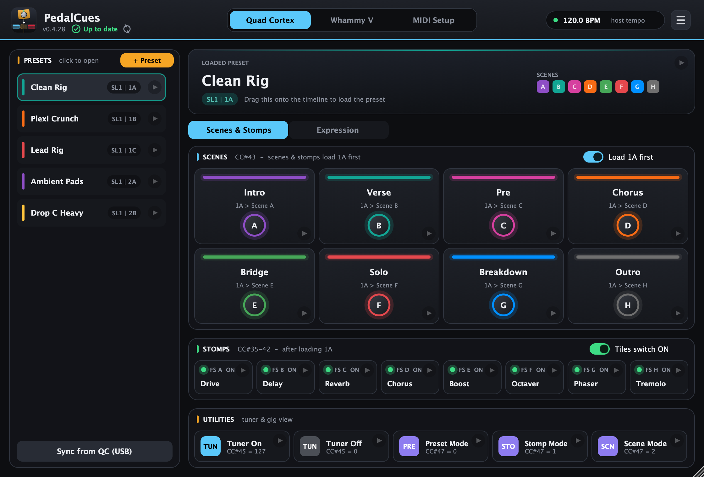
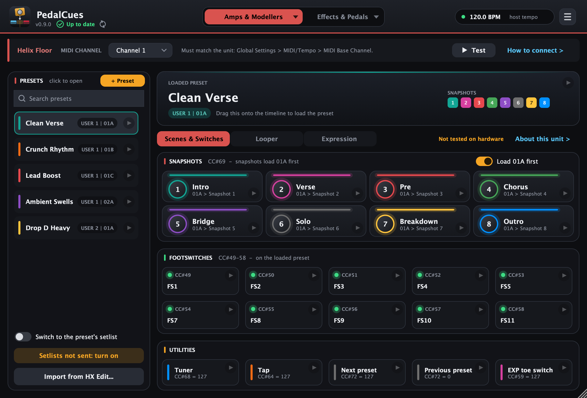
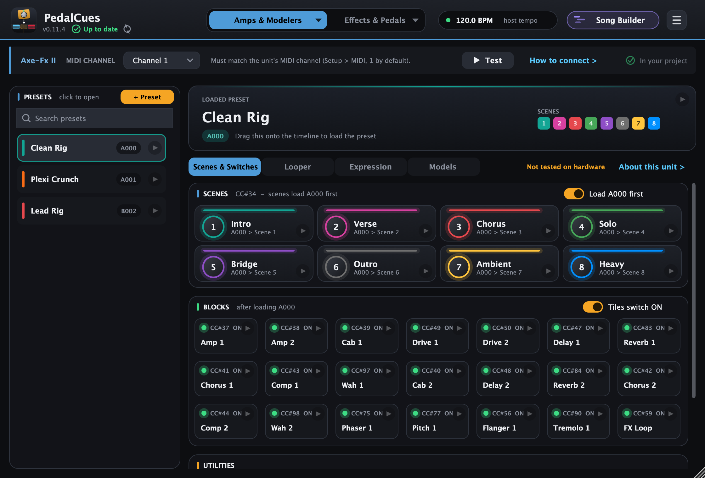
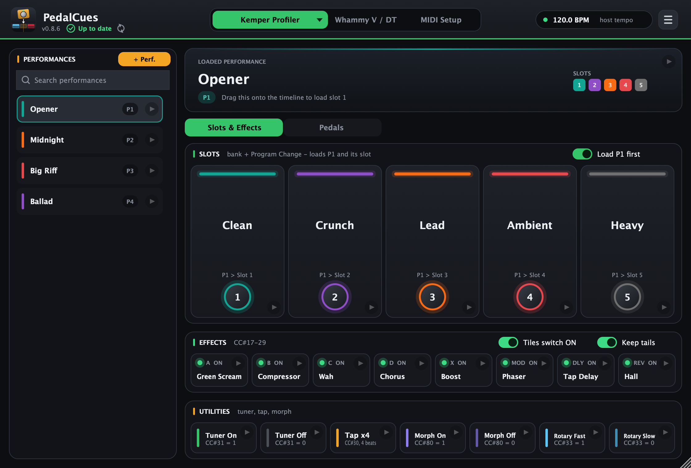
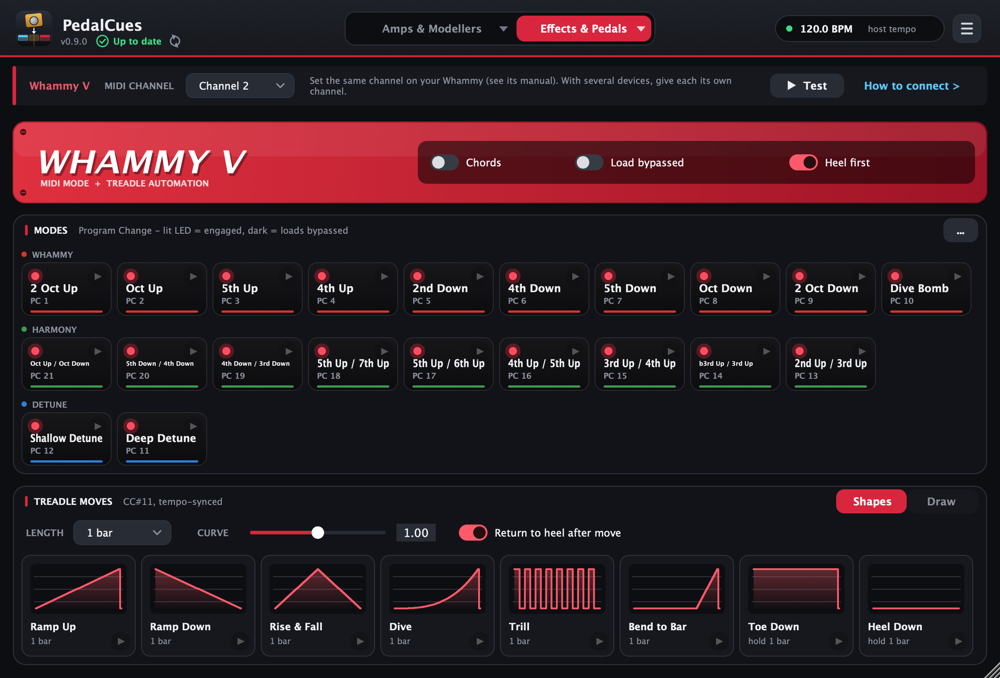
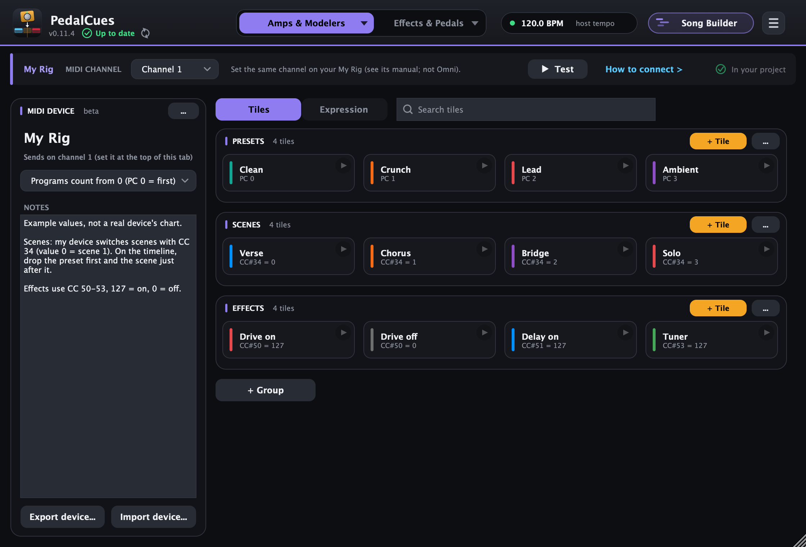
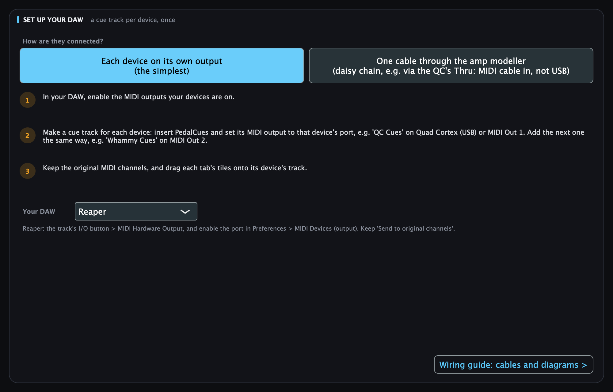

# PedalCues

Drag-and-drop MIDI cues for the **Neural DSP Quad Cortex, QC Mini and Nano Cortex**, the **Kemper Profiler / Kemper Player**, **Fractal Audio** (Axe-Fx, FM, AX8, FX8, VP4), **Line 6** (Helix, HX, POD Go, Helix Stadium, DL4 MkII, HX One), **HeadRush** (Core, Prime, Flex Prime, Pedalboard, Gigboard, MX5), **Darkglass** (Anagram, Infinity 500 Combo, Exponent 500, Microtubes Infinity) and **Boss** (GT-1000) units (beta), the **DigiTech Whammy V / Whammy DT**, and effect pedals from **Strymon** (TimeLine, BigSky, Mobius, MX, Volante, the V2 series...), **Boss** (DD-500, RV-500, MD-500), **Meris**, **Chase Bliss**, **Walrus Audio**, **Source Audio** and **EHX** (beta) & more amp modellers, effects and pedals, plus **any other MIDI device** with tiles you make yourself (beta).
A VST3 / AU / LV2 / Standalone plugin (JUCE) for Windows, macOS and Linux. Tested in Reaper; it should work in any DAW that accepts dragged MIDI files and can send a MIDI track to a hardware output (Ableton Live, Cubase, Bitwig, Studio One; in Logic the clips work on an External MIDI track).

**[Download for Windows, macOS and Linux](https://thankost.github.io/pedal-cues/)**

Drag a tile onto the arrangement → a **named MIDI item** lands at the drop position (e.g. `QC Scene B - Chorus`,
`Whammy Oct Up [Chords]`, `Whammy Ramp Up 1 bar`). Click a tile's ▶ corner to send it to the pedal right away.



📖 **[User guide with pictures and step-by-step instructions](https://thankost.github.io/pedal-cues/guide.html)** · 📝 **[What's new](https://thankost.github.io/pedal-cues/changelog.html)** · 🛟 **[Help and problem reports](https://thankost.github.io/pedal-cues/help.html)**. A quick tour also starts the first time you open the plugin (open it again later from the **☰** menu).

| Helix (Line 6) | Axe-Fx II (Fractal) | Kemper |
|---|---|---|
|  |  |  |

| Whammy V / DT | Custom MIDI device | How to connect |
|---|---|---|
|  |  |  |

## Features

**Quad Cortex**
- Preset tiles (name, colour, setlist / bank / slot) → `CC#0` page [+ `CC#32` setlist] + Program Change
- **Sync from QC (USB):** reads your setlists, preset names (bank/slot), and scene names, scene colours and stomp names straight from the pedal (quit Cortex Control first). Optional "every preset" mode loads each preset in turn to read it. The QC doesn't report setlist numbers, so you check them once in the sync window and PedalCues remembers them; the sync also turns on *Switch to the preset's setlist*
- 8 scene tiles per preset in gig-view colours → `CC#43`
- **QC Mini:** pick *Quad Cortex Mini* in the device list. Scenes and footswitches in labelled Page I and Page II groups of A–D (Page II = the QC's E–H), plus Page I / Page II tiles → `CC#64`.
- Scene and stomp tiles either **load their own preset first** (default; the scene/footswitch follows 1/16 later)
  or act on the **current QC preset** only
- Footswitch stomps A–H on/off → `CC#35–42`; tuner on/off → `CC#45`; tap tempo → `CC#44`; Gig View screen on/off → `CC#46`; footswitch mode (preset / stomp / scene) → `CC#47`
- **Looper X** (Quad Cortex page > **Looper**) → `CC#48–60`: record / overdub, play / stop, undo / redo, one shot, reverse, half speed, duplicate, punch in / out, quantize and the looper screen (the preset needs a Looper X block)
- **Expression automation** (Quad Cortex page > **Expression**) → `CC#1` / `CC#2`: moves whatever you assign to
  Expression 1 or 2 on the QC (volume swells, wah, a delay mix, drive). Swell In, Fade Out, Rise & Fall, Slow Rise,
  Wah Rhythm, Rise to Bar, Toe, Heel, fixed positions (heel / 25% / half / 75% / toe), or draw your own; tempo-synced.
  Acts on the loaded preset, or optionally **loads the open preset first** (safe if a preset gets changed by accident)

**Kemper Profiler / Kemper Player** (pick the unit with the ▾ on the first tab)
- Performance tiles with five slots each → bank select `CC#32` + Program Change (Player: Program Change, 10 banks of 5)
- Slot tiles either **load their performance first** (default) or switch a slot of the **current performance** → `CC#50–54`
- Effect modules A, B, C, D, X, MOD, DLY, REV on/off (`CC#17–29`, delay and reverb with or without tails)
- Tuner (`CC#31`), Tap x4 (`CC#30`), Morph (`CC#80`), Rotary fast/slow (`CC#33`)
- **Pedal moves** on Wah (`CC#1`), Pitch (`CC#4`), Volume (`CC#7`) or Morph (`CC#11`): the same shapes, Set to tiles and Draw as QC expression
- Built from Kemper's MIDI documentation; not tested on a real Kemper yet

**Fractal Audio, Line 6, HeadRush and Darkglass (beta), and the Nano Cortex**, built from the manuals, not tested on hardware yet (pick them from the searchable device list, the ▾ on the first tab):
- **Pages like the Quad Cortex** for units with defined MIDI numbers: Helix Floor / LT / Rack, HX Stomp, HX Stomp XL, HX Effects, POD Go, Helix Stadium (Line 6) and Axe-Fx II / XL / XL+, AX8, FX8 (Fractal factory defaults). Presets with setlists or banks as the unit shows them, scenes / snapshots named per preset (load the preset first, or not), footswitches or blocks, utilities, looper and expression moves
- **Templates** for the Axe-Fx III, FM9, FM3 and VP4, which have no default MIDI CCs: preset tiles plus scene, tuner and looper tiles with suggested numbers to set on the unit (see *Any MIDI device* below)
- **HeadRush pages**: Core, Prime, Flex Prime, Pedalboard, Gigboard, MX5. Presets by each rig's MIDI PROG number, scenes (Core 10, Prime 8, Flex Prime 6, CC#21 and up), block toggles (CC#75 and up), tuner, tap, rig and footswitch modes, looper and expression. HeadRush documents MIDI cables only (no MIDI over USB from a computer)
- **Darkglass Anagram page**: presets 01A-42C, scenes A-C, footswitches A-C, tuner, modes, looper, expression and knob moves. **Neural DSP Nano Cortex page**: 64 presets, slot bypass (gate, capture, cab, FX 1-5), tuner, tap and expression (no MIDI Out, so no daisy chain) **Darkglass Infinity 500 Combo / Exponent 500 pages**: presets 1-5, bypass and mute, effects or footswitches, drive modes and IR slots (Combo), expression moves on every control

**Any MIDI device (beta)**: anything that takes MIDI, including units where you set up the MIDI mapping yourself
- **Templates** for units with their own MIDI mapping: Axe-Fx III, FM9, FM3, VP4, **Boss GT-1000 / GT-1000CORE** and **Darkglass Microtubes Infinity** (from a community chart; TRS Type B MIDI). Ready-made tiles from the manual plus what to set on the unit; adjust them to your numbers
- **Your own device** for anything else (another Boss, a synth, a looper...), from its MIDI chart
- Groups and tiles you name yourself; each tile is one or more standard messages (Program Change, Control Change, bank select), set up in a guided editor with ready-made starting points and a Test button
- Programs counted from 0 or 1, as the device's manual does; notes on the device and on each tile
- **Expression moves** on any device: swells, fades, wah, Set to tiles and drawn moves on the CC you pick (CC#11 by default, the MIDI standard Expression), saved with the device
- **Export / Import device** as a `.pedalcues-device` file, so one person sets up a device and everyone with the same gear imports it

**Two tabs: Amps & Modellers and Effects & Pedals.** The second tab shows the **Whammy V / Whammy DT** by default, the **Line 6 DL4 MkII** or **HX One** (beta: presets, controls, looper, expression and, on the DL4, every delay and reverb model), a pedal template, any of your MIDI devices (a delay, a looper...), or nothing if you only have one device: pick it with the ▾ on the tab. Each pedal keeps its own MIDI channel.

**Whammy V / Whammy DT** (two devices in the Effects & Pedals list)
- All 21 modes, Classic or Chords (Chords on the V only), engaged or bypassed (Program Change)
- **Whammy DT Drop Tune:** Shift Up and Shift Down tiles, 1–7 semitones, Oct and Oct + Dry, on or bypassed (Program Change 43–78)
- Optional "heel before mode change" (`CC#11 = 0`)
- Treadle moves on `CC#11`: Ramp Up, Ramp Down, Rise & Fall, Dive, Trill (1/16), Bend to Bar, Toe, Heel
- Draw your own treadle move with the mouse, then drag it onto the timeline like any other move
- **Wave...** in Draw mode generates a sine, triangle, square or saw (waves, phase, shape, low / high, grow, speed), like Reaper's CC LFO; on the treadle and on every expression pedal
- **Import MIDI...** in every Draw mode: load a move you drew as CC automation in your DAW from a `.mid` file and reuse it in any song (saved in My drawings)
- **My drawings:** save your drawn moves by name, load them to reuse or edit, rename or delete them. Kept on your computer
  (every project sees them, updates keep them), shared by the Whammy treadle and QC expression, and included in Export setup
- Moves are written in beats (1/16 to 4 bars), so they follow the project tempo; adjustable curve;
  optional return to heel afterwards

**Workflow**
- **Search every list:** presets on the Quad Cortex, Fractal, Line 6, HeadRush, Darkglass and Nano Cortex pages, Kemper performances, custom device tiles and the device list. Forgiving: letters in order (`drpc` finds *Drop C Heavy*), one typo, or a location like `SL2` / `3B`
- Update notice: the header shows your version and whether a newer release is out (one GitHub request when it opens; turn it off in the ☰ menu)
- Everything is stored in your DAW project. **☰ > Save as default setup** makes new instances start with your names, colours, MIDI settings and playing preferences
- **☰ > Export / Import setup** as a file (back it up, move to another computer, share it with the band): your presets, scenes and names for every unit (Quad Cortex, Kemper, Fractal / Line 6 / HeadRush / Darkglass / Nano Cortex pages, custom MIDI devices), MIDI settings, playing preferences, your wiring choice and My drawings
- MIDI passes through, so the dropped items and the live preview share one track and one route
- **A MIDI strip at the top of each page:** the device's own MIDI channel (every device keeps its own, saved with your setup), **Test** and **How to connect**. How to connect asks how your devices are connected only when you have two, lists the cue tracks with your devices as examples, and shows where your DAW sets a track's MIDI output; in the standalone app it also picks the MIDI port

Preset and scene names are entered in the plugin (double-click to rename, right-click for colour/reorder), read from the Quad Cortex with **Sync from QC (USB)**, imported from an **HX Edit** export on the Helix / HX pages, or (beta) read over MIDI from Strymon TimeLine / BigSky / Mobius, Boss DD/RV/MD-500, GT-1000 and Fractal Axe-Fx III / FM9 / FM3 / VP4.

## Install (no code needed)

Download the installer or zip for your system from the [website](https://thankost.github.io/pedal-cues/) or the [Releases page](https://github.com/thankost/pedal-cues/releases/latest).

**Windows** (10 / 11, 64-bit)
1. Run `PedalCues-Windows-Setup.exe`. It isn't code-signed, so the first time Windows says *"Windows protected your PC"*: click **More info > Run anyway**.
2. Click through the installer. The VST3 goes to `C:\Program Files\Common Files\VST3\`, the standalone app to *Program Files* (Start menu: PedalCues). A newer installer replaces the older version; it asks you to close PedalCues or your DAW if they're open.
3. Re-scan plug-ins in your DAW (Reaper: *Options > Preferences > Plug-ins > VST > Re-scan*).

Prefer copying by hand? `PedalCues-Windows.zip` has the same files: copy `PedalCues.vst3` to `C:\Program Files\Common Files\VST3\`.

**macOS** (Apple Silicon: macOS 11 or later; Intel: macOS 10.13 High Sierra or later)
1. Open `PedalCues-macOS.pkg`. It isn't notarised by Apple, so the first time macOS says it can't verify it:
   click **Done**, then *System Settings > Privacy & Security > Open Anyway*.
2. Click **Install**. The app goes to *Applications*, the VST3 and AU to `/Library/Audio/Plug-Ins/`.
3. Re-scan plug-ins in your DAW.

Prefer copying by hand? `PedalCues-macOS.zip` has the same files; see the [guide](https://thankost.github.io/pedal-cues/guide.html#1-install)
(it needs a one-time `xattr -cr` in Terminal). Coming from a zip install? Delete the old copies in `~/Library/Audio/Plug-Ins/`.

**Linux** (x86-64, Ubuntu 22.04+ / Debian 12 / Fedora and similar)
1. Unzip `PedalCues-Linux.zip` and run `./install.sh` in the `PedalCues-Linux` folder: the VST3 goes to `~/.vst3/`, the LV2 to `~/.lv2/`, the app to `~/.local/bin/` (and your applications menu). Run it again with a newer zip to update; `./install.sh --uninstall` removes it.
2. For *Sync from QC* over USB, add the one-time permission rule:
   `echo 'KERNEL=="hidraw*", ATTRS{idVendor}=="152a", TAG+="uaccess"' | sudo tee /etc/udev/rules.d/70-quad-cortex.rules && sudo udevadm control --reload-rules && sudo udevadm trigger`
   then replug the QC. Details: [guide, Install](https://thankost.github.io/pedal-cues/guide.html#1-install).

## Build (macOS)

```bash
brew install cmake ninja
bash build.sh
```

The build installs the VST3 and AU plugins to `~/Library/Audio/Plug-Ins` and also produces a standalone app.
If `external/JUCE` is missing, the script clones JUCE 8.0.8 there.

Run the MIDI logic tests:

```bash
cmake --build build --target PedalCuesTests
./build/PedalCuesTests_artefacts/Release/PedalCuesTests
```

## DAW setup (Reaper as the example)

1. Connect your devices one of three ways. **How to connect** (at the top of each page) and the **Wiring guide** show each, with your unit as the example. "Your unit" is the Quad Cortex, Kemper, Fractal, Line 6, HeadRush, Darkglass, Nano Cortex or custom device on the first tab; the second device, if you have one, is for example a Whammy:
   - **One device:** your unit on USB, or a MIDI cable from your interface's MIDI Out to its MIDI In. One cue track.
   - **Daisy chain:** interface **MIDI Out → your unit's MIDI In**, its **MIDI Thru → the second device's MIDI In** (MIDI Thru on). Both cue tracks output to that interface MIDI Out.
   - **Separate outputs:** your unit on **USB or MIDI Out 1**, the second device on **MIDI Out 2**. Each cue track outputs to its device's port.
   - ⚠️ **A MIDI Thru only passes on MIDI from the 5-pin MIDI In**, not MIDI received over **USB** (confirmed for the Quad Cortex and Kemper, true for most units). So "your unit on USB, the second device on its Thru" doesn't work; the Wiring Guide notes the exceptions (Helix Stadium with *MIDI Over USB C*, Axe-Fx II with *USB Adapter Mode*). The Whammy has only a 5-pin MIDI In, so it always needs a MIDI cable; POD Go has only USB MIDI, so it can't be in a chain.
2. Give each device its **own MIDI channel** (not Omni; e.g. your unit on 1, the Whammy on 2) and set the same number at the top of each device's page, **before** dragging cues: every clip keeps the channel it was dragged with. Click **Done** in the strip to hide the reminder.
3. In your DAW, enable the MIDI outputs you use (Reaper: *Preferences > MIDI Devices*).
4. Create one track per device (e.g. **QC Cues** and **Whammy Cues**), insert *PedalCues* on each, and set each track's MIDI output as above (Reaper: *I/O > MIDI Hardware Output*, leave *Send to original channels*).
5. Turn snapping on and drag each device's tiles onto its own track at the bars you want.

Details and pictures: [guide, section 2](https://thankost.github.io/pedal-cues/guide.html#2-connect-your-rig).

## Verify with your pedals

- **Whammy numbering:** the plugin uses the manual's 1-based numbers (Classic 1–21 on / 22–42 bypassed,
  Chords 43–63 on / 64–84 bypassed; on the Whammy DT, 43–78 are Drop Tune). If every mode arrives one step off, choose *Zero-based* in the Whammy page's
  **...** menu (Modes header). Mode names can be renamed if your chart differs.
- **QC setlist:** `CC#32` = the setlist number as the QC shows it (0 = Factory Presets). Turn on *Switch to the preset's setlist* (under the preset list) when your presets are in more than one setlist (the QC page shows a reminder), and drag preset clips in again after turning it on.

## Layout

```
Source/CueModel.*        MIDI definitions for both pedals + .mid file writer
Source/State.*           ValueTree schema, defaults, setup (names, MIDI settings, preferences) save/load, My drawings
Source/Tile.*            draggable tile (external file drag + click-to-send)
Source/PluginProcessor.* MIDI passthrough, preview scheduling, host tempo, state
Source/Theme.*           colour palette + custom LookAndFeel
Source/PluginEditor.*    window, header tabs, first-run tour host
Source/QcPage.cpp        Quad Cortex page (+ QcExpression.cpp)    Source/KemperPage.cpp  Kemper page
Source/Modellers.*       Fractal / Line 6 / HeadRush / Darkglass / Nano Cortex profiles (from the manuals)    Source/ModellerPage.cpp  their pages
Source/DeviceTemplates.* templates: Axe-Fx III / FM9 / FM3 / VP4, Boss GT-1000, Microtubes Infinity    Source/CustomPage.cpp  custom MIDI devices + tile editor
Source/UnitPicker.cpp    searchable device list    Source/Fuzzy.h  fuzzy search    Source/MovesPanel.*  expression / treadle moves
Source/QcUsb.*, QcSyncDialog.cpp  Sync from QC (USB, read-only)
Source/WhammyPage.cpp    Whammy V / DT page
Source/SettingsPage.cpp  MIDI strip (channel, Test), How to connect window (DAW tracks, standalone port) and the wiring guide
Source/Tour.*            quick-tour overlay (steps + spotlight)
Tools/DocShots.cpp       renders docs/images/*.png
docs/GUIDE.md            user guide
```

## Regenerating the documentation images

```bash
cmake -S . -B build -G Ninja -DCMAKE_BUILD_TYPE=Release -DPEDALCUES_BUILD_DOCS=ON
cmake --build build --target DocShots
build/DocShots_artefacts/Release/DocShots docs/images
```

## Support

PedalCues is free. If it helps your show and you'd like to say thanks, you can donate (completely optional):
[Buy Me a Coffee](https://buymeacoffee.com/athkost) · [PayPal](https://paypal.me/athkost) · [Revolut](https://revolut.me/athkost) · [GitHub Sponsors](https://github.com/sponsors/thankost). In the plugin: **☰ > Support PedalCues**.

## License

Free and open source under the [MIT License](LICENSE). Copyright (c) 2026 **Thanasis Kostopoulos**. [github.com/thankost/pedal-cues](https://github.com/thankost/pedal-cues)

Built with [JUCE](https://juce.com), which is licensed separately (AGPLv3 / JUCE licence), and [hidapi](https://github.com/libusb/hidapi) (BSD licence option). The USB sync follows the protocol documented by [pyquadcortex](https://github.com/stokes-audio/pyquadcortex) (MIT). All product and company names (Neural DSP, Quad Cortex, Kemper, Fractal Audio, Axe-Fx, Line 6, Helix, POD, HeadRush, Boss, Darkglass, DigiTech, Whammy and others) are trademarks of their respective owners. This project is not affiliated with any of them.
