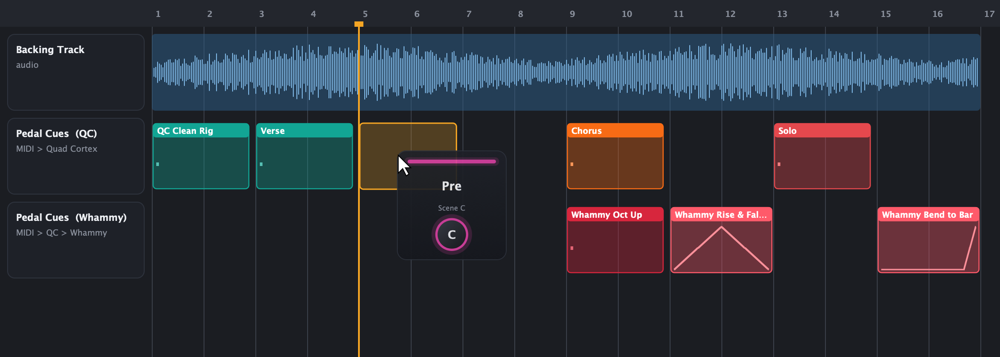
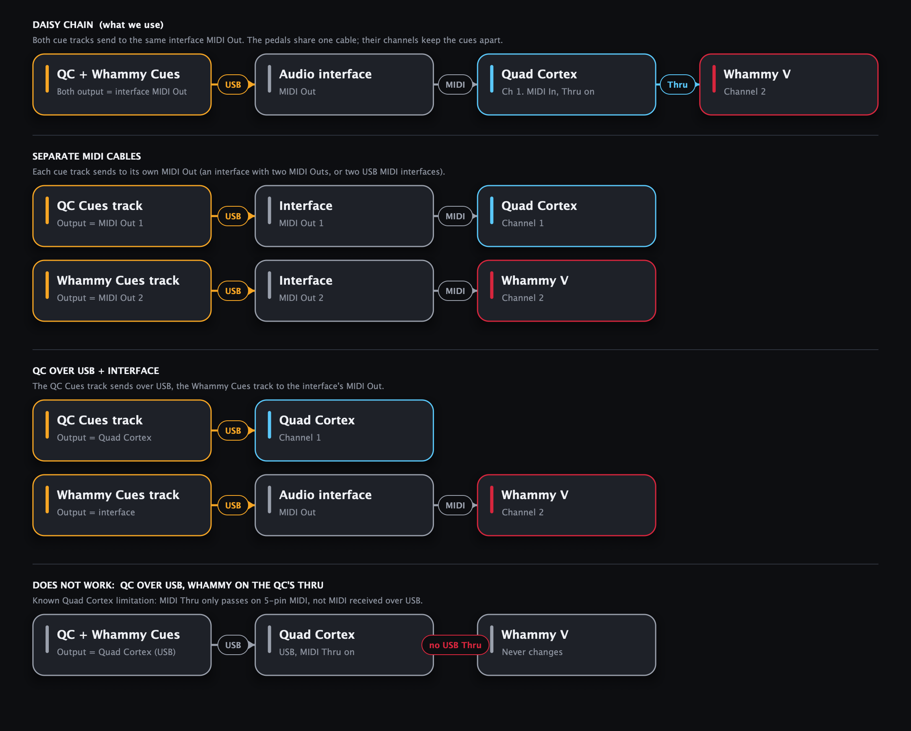
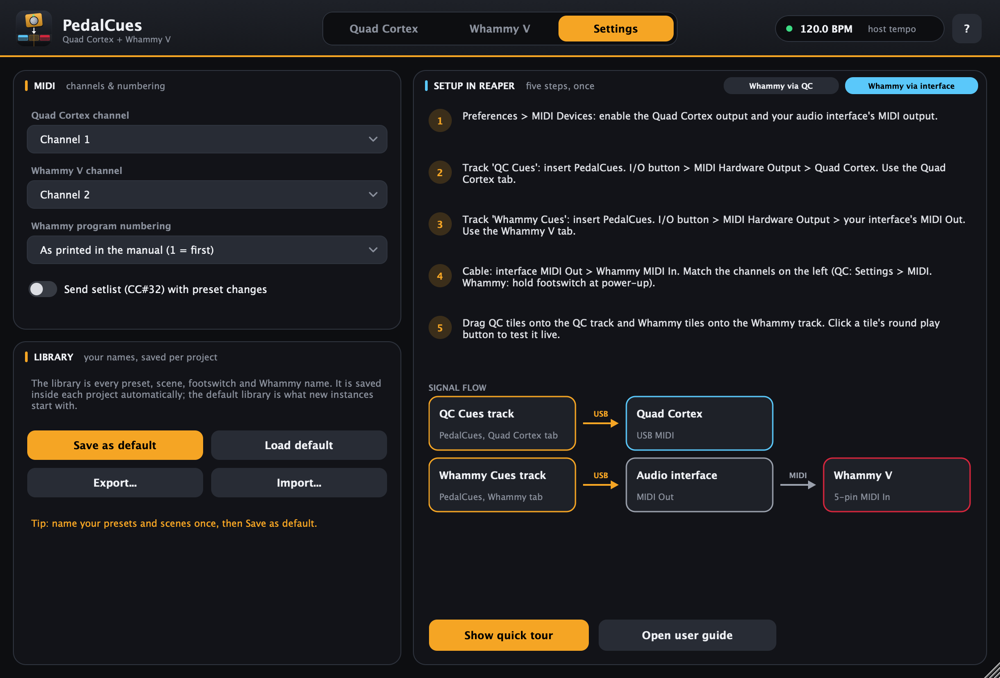
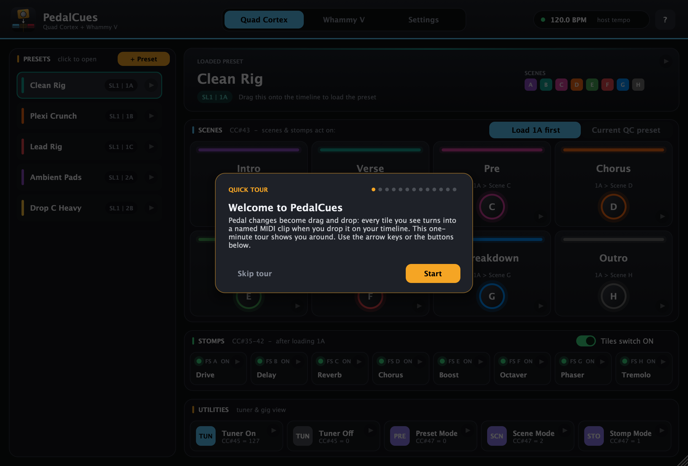
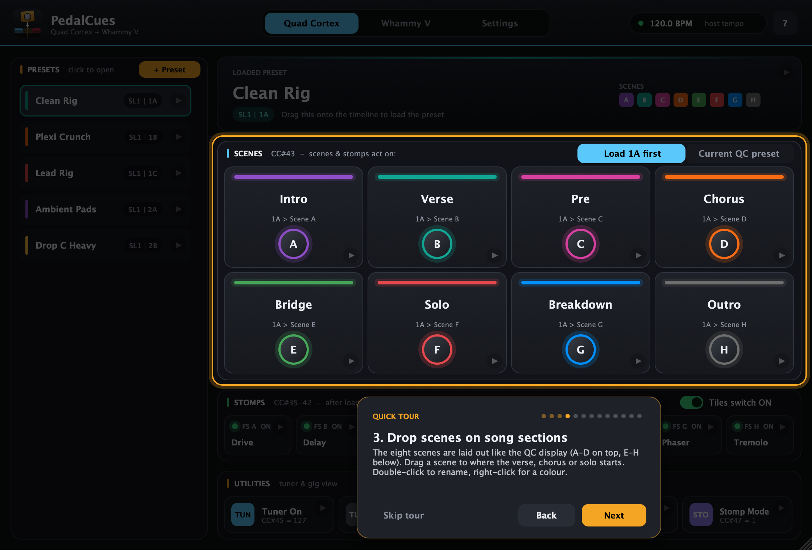
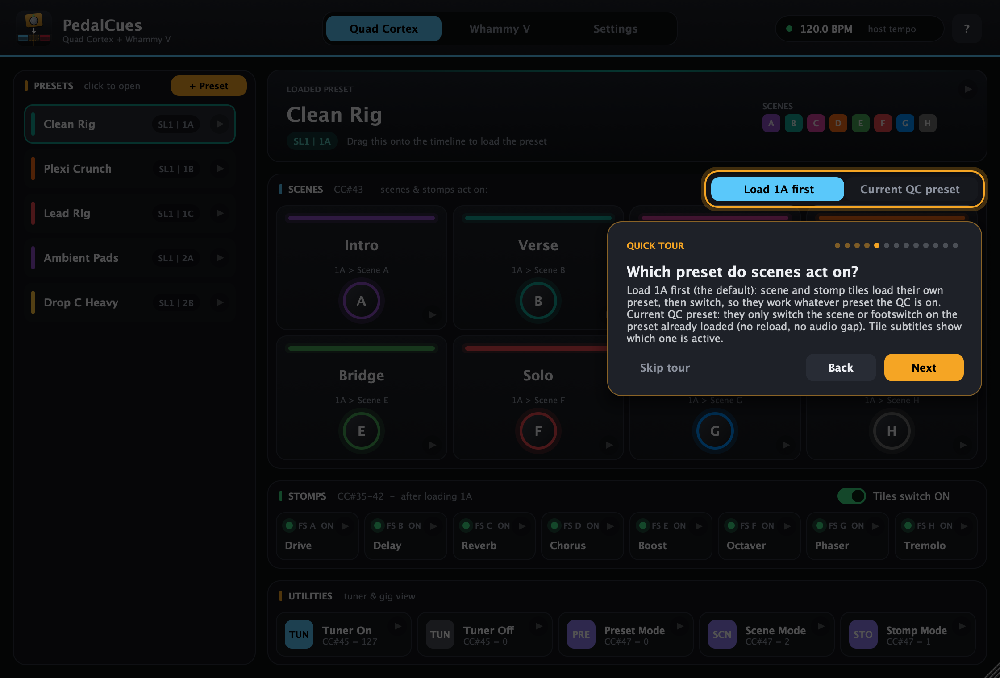
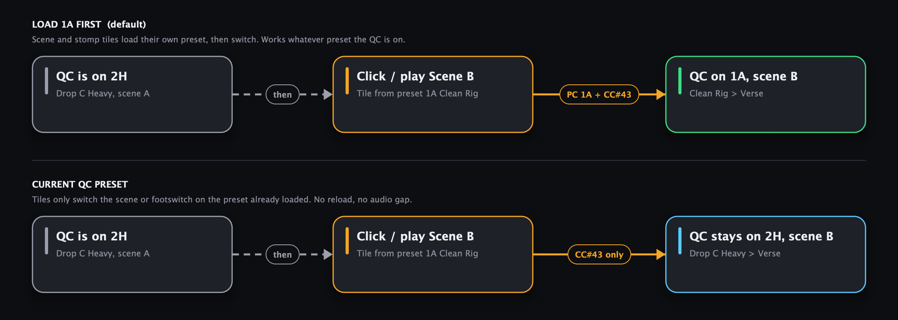
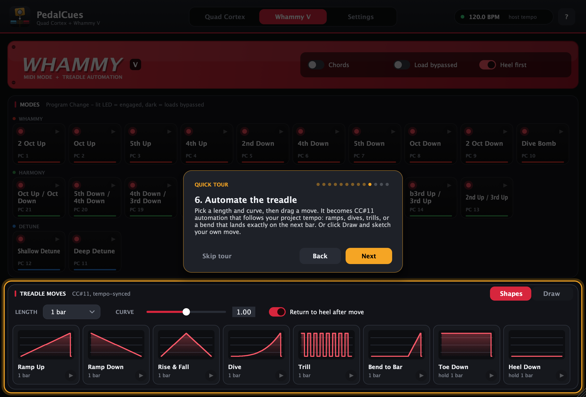
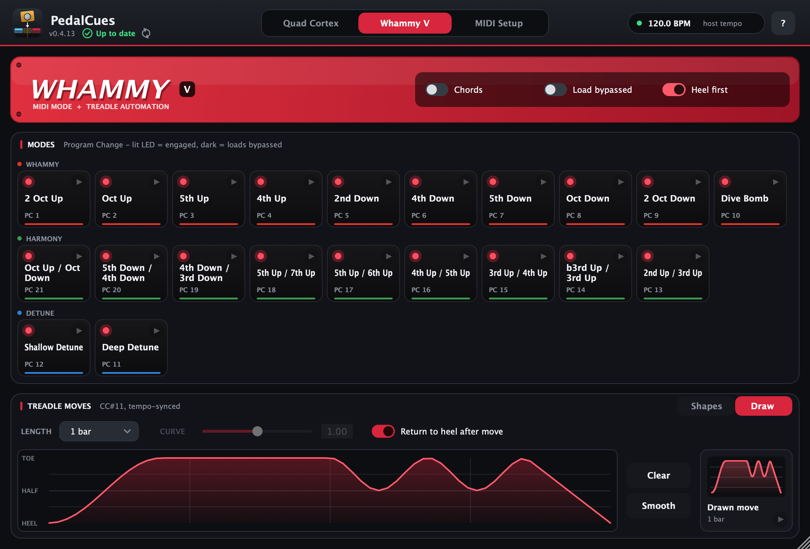

# PedalCues user guide

PedalCues turns pedal changes into **drag and drop**. Each tile in the plugin is a Quad Cortex preset, a scene, a footswitch, the tuner, a Whammy V mode, or a Whammy treadle move. Drag a tile onto your DAW timeline and it lands as a **named MIDI clip** at that bar. Press play, and your rig follows the song.



---

## Contents

1. [Install](#1-install)
2. [Connect your pedals](#2-connect-your-pedals)
3. [Set up Reaper (once)](#3-set-up-reaper-once)
4. [First launch: the quick tour](#4-first-launch-the-quick-tour)
5. [Quad Cortex page](#5-quad-cortex-page)
6. [Build a song, step by step](#6-build-a-song-step-by-step)
7. [Whammy V page](#7-whammy-v-page)
8. [Settings and your library](#8-settings-and-your-library)
9. [Troubleshooting](#9-troubleshooting)

---

## 1. Install

You don't need the source code. Download the latest zip from the [PedalCues website](https://thankost.github.io/pedal-cues/) or the [Releases page](https://github.com/thankost/pedal-cues/releases/latest).

| System | Download | Put it here |
|---|---|---|
| Windows | `PedalCues-Windows.zip` | Copy `PedalCues.vst3` to `C:\Program Files\Common Files\VST3\` |
| macOS (Apple Silicon or Intel) | `PedalCues-macOS.zip` | `PedalCues.app` to *Applications*, `PedalCues.vst3` to `~/Library/Audio/Plug-Ins/VST3/`, `PedalCues.component` to `~/Library/Audio/Plug-Ins/Components/` |

On **macOS**, the app isn't notarised by Apple. Without the next step, macOS says *"PedalCues is damaged and can't be opened"*. It isn't damaged; macOS is blocking an app that was downloaded from the internet. Clear the flag **once, right after unzipping**: open *Terminal* and run

```bash
xattr -cr ~/Downloads/PedalCues-macOS
```

(If you unzipped somewhere else, type `xattr -cr ` and drag the unzipped folder into the Terminal window, then press Return.) Then drag `PedalCues.app` to *Applications* and copy the plugins as shown in the table.

> Already copied the plugins? Run `xattr -cr ~/Library/Audio/Plug-Ins/VST3/PedalCues.vst3 ~/Library/Audio/Plug-Ins/Components/PedalCues.component /Applications/PedalCues.app` instead.
>
> Without Terminal: open the app once, click **Done**, then go to *System Settings > Privacy & Security* and click **Open Anyway** next to the PedalCues message.

In **Reaper**, go to *Options > Preferences > Plug-ins > VST* and click **Re-scan**. PedalCues appears under *Instruments*.

> There's also a Standalone app (`PedalCues.exe` / `PedalCues.app`) for testing tiles against the pedal without a DAW. In its *Options > Audio/MIDI Settings*, set **MIDI Output** to the Quad Cortex and pick a working audio **Output** device (any one). The app only sends MIDI while an audio device is running. Leave the MIDI inputs unticked.

---

## 2. Connect your pedals

There are two ways to connect the pedals. Choose the one that suits your rig. The plugin's **Settings** tab has a switch for both and shows the matching steps.



**Option A: Whammy via QC.** Use this if you only have the two pedals.
- Connect the **Quad Cortex / QC Mini** to the computer with USB.
- Run a MIDI cable from the QC's **MIDI Out** to the Whammy's **MIDI In**.
- Turn on **MIDI Thru** in the QC's MIDI settings.

**Option B: Whammy via audio interface.** Use this if your sound card or a USB MIDI interface has a 5-pin **MIDI Out**, or if your QC doesn't forward USB MIDI.
- Connect the **Quad Cortex** to the computer with USB.
- Run a MIDI cable from the interface's **MIDI Out** to the Whammy's **MIDI In**.

**Both options: channels.** Give each pedal its own MIDI channel. The defaults are QC = 1 and Whammy = 2.
- QC: *Settings > MIDI Settings > MIDI Channel*.
- Whammy V: hold the footswitch while powering up, then turn the knob to pick the channel.

---

## 3. Set up Reaper (once)

First, in *Preferences > Audio > MIDI Devices*, enable the **Quad Cortex** MIDI output. For option B, also enable your **interface's MIDI output**.

### Option A: one cue track

1. Create a track called **Pedal Cues** and insert **PedalCues** on it.
2. Click the track's **I/O (routing)** button. Under *MIDI Hardware Output*, choose the **Quad Cortex**.
3. Drag QC and Whammy tiles onto this track.

### Option B: one cue track per pedal

1. Create a track **QC Cues** and insert **PedalCues** on it.
   - Set *I/O > MIDI Hardware Output* to the **Quad Cortex**.
   - Use the plugin's Quad Cortex tab here.
2. Create a track **Whammy Cues** and insert **PedalCues** on it.
   - Set *I/O > MIDI Hardware Output* to your **interface's MIDI Out**.
   - Use the plugin's Whammy V tab here.
3. Drag QC tiles onto the QC track and Whammy tiles onto the Whammy track. Each track's play button test also goes to the right pedal.



**For both options:**
- Turn **snap to grid** on so clips land exactly on bars.
- Optional: save the track(s) as a **track template** so every new song starts with them.

---

## 4. First launch: the quick tour

The first time you open PedalCues, a quick tour walks you through every area. It dims the window, highlights one part at a time, and explains it.



- Move through it with **Next / Back** or the **arrow keys**. **Esc** or *Skip tour* closes it.
- Open it again any time from the **?** button in the top-right corner or with **Settings > Show quick tour**.



One step explains the **Load 1A first / Current QC preset** choice:



---

## 5. Quad Cortex page


**Presets vs scenes:** a *preset* is a whole rig on the QC (often one per song), such as *Clean Rig* or *Drop C Heavy*. *Scenes* are the parts of the song inside that preset, such as *Intro*, *Verse* and *Chorus*. Load the preset once where the song starts, then switch scenes as the song moves on.

| Area | What it does | MIDI sent |
|---|---|---|
| **Presets** (left) | Your QC presets. Click one to open it; drag it to load that preset. | `CC#0` bank page, optional `CC#32` setlist, then Program Change |
| **Loaded preset** screen | The opened preset, with its location and scene colours. Drag it like a preset. | Same as above |
| **Scenes** | 8 scenes laid out like the QC display: **A-D top, E-H bottom**. | `CC#43` = 0-7 |
| **Load 1A first / Current QC preset** | Picks which preset scene and stomp tiles act on. See [below](#which-preset-do-scenes-and-stomps-act-on). | Preset + `CC#43` / `CC#35-42`, or the CC alone |
| **Stomps** | Switch one footswitch A-H. The header switch picks whether tiles send **ON** or **OFF**. | `CC#35-42` |
| **Utilities** | Tuner on/off and gig view mode (Preset / Scene / Stomp). | `CC#45`, `CC#47` |

**Every tile:**

- **Drag** it onto the timeline to create a named MIDI clip, for example `QC Scene D - Chorus`.
- **Click the round play button** to send it to the pedal immediately.
- **Double-click** to rename it. **Right-click** for colour, reorder, duplicate, delete, or *Send to pedal now*.

### Which preset do scenes and stomps act on?

The choice at the top right of the **Scenes** header decides this for both scene and stomp tiles:

- **Load 1A first** (the default; the button names the preset you have open). A scene or stomp tile first loads its own preset, then switches the scene or footswitch 1/16 later. It works whatever preset the QC is on. Scene tiles read `1A > Scene B` and the Stomps header says *after loading 1A*.
- **Current QC preset.** A tile sends only the scene or footswitch change, and the QC applies it to the preset it already has loaded. There's no preset reload, so no audio gap. Use this for scene changes inside a song, after a preset clip. Scene tiles read `Scene B - current preset`.



The clip names show the difference on the timeline too: `QC Clean Rig > B - Verse` loads the preset first, while `QC Scene B - Verse` switches only the scene.

> Projects saved with PedalCues 0.4.2 or older keep their old choice. If yours was set to *Current QC preset* and you want the new behaviour, click **Load … first** once.

### Adding a preset

1. Click **+ Preset**.
2. Type its name, setlist number, bank (1-32) and slot (A-H), exactly as the QC shows them. For example, *Setlist 1, bank 3, slot B* is shown as `SL1 | 3B`.
3. Click the preset in the list, then double-click each scene to give it the same name as on your QC.
4. Right-click a scene to give it the same colour you use on the pedal.

---

## 6. Build a song, step by step

This example covers a song with a clean verse, a crunchy chorus and a Whammy solo.

1. **Load the preset at bar 1.** Click *Clean Rig* in the list, then drag the **Loaded preset** screen to bar 1.
2. **Set the intro scene.** With **Load 1A first** selected (the default), dragging the **Intro** scene tile to bar 1 loads the preset and the scene in one clip. With *Current QC preset*, drag the preset first, then the scene just after it.
3. **Mark every section.** Drag **Verse** to bar 3, **Chorus** to bar 9, **Solo** to bar 13, and so on. Each clip is named after the scene, so the arrangement reads like a setlist.
4. **Whammy mode for the solo.** On the Whammy tab, drag **Oct Up** to one beat before the solo.
5. **Treadle move.** Set *Length* to `2 bars`, then drag **Rise & Fall** to the bar where the bend starts.
6. **Test.** Press play in Reaper and watch the QC and the Whammy follow. To check a single cue, click its tile's play button.
7. **Tuner between songs.** Drop **Tuner On** at the end of the song and **Tuner Off** before the next one.

> Clips are ordinary MIDI items. You can move, copy, split or delete them like any other item. Their names come from your tiles, so renaming a scene before you drag it keeps the timeline readable.

---

## 7. Whammy V page


### Modes

The 21 Whammy V modes are laid out like the pedal's panel:
- **Top row:** the **Whammy** modes, from 2 Oct Up to Dive Bomb.
- **Middle row:** each **Harmony** mode sits right below the Whammy mode that shares its row on the pedal (Oct Up/Oct Down below 2 Oct Up, and so on).
- **Bottom row:** **Detune** Shallow and Deep, on their own row as at the bottom of the pedal.

Colours match the pedal: **Whammy** (red), **Harmony** (green), **Detune** (blue). Each tile shows its Program Change number from the DigiTech manual. Drag a mode tile to switch the Whammy.

- **Chords:** uses the polyphonic *Chords* program range (43-84) instead of *Classic* (1-42).
- **Load bypassed:** selects the mode without engaging the effect. The tile LEDs go dark to show this.
- **Heel first:** sends `CC#11 = 0` before switching, so the new mode starts from heel with no pitch jump.

### Treadle moves



Treadle moves are **CC#11** automation written in beats, so they follow your project tempo. Each tile shows its curve. You can also [draw your own](#draw-your-own-move).

| Move | What it does |
|---|---|
| Ramp Up / Ramp Down | Heel to toe, or toe to heel, over the length |
| Rise & Fall | Heel to toe and back |
| Dive | Slow start, then accelerates to toe (try it with *Dive Bomb*) |
| Trill | Toggles heel/toe on 1/16 notes |
| Bend to Bar | Holds heel, then bends in the last beat so it lands on the next bar line |
| Toe Down / Heel Down | Jumps and holds |

- **Length:** from 1/16 note up to 4 bars.
- **Curve:** `1.00` is linear, lower values start fast, higher values start slow.
- **Return to heel after move:** adds a `CC#11 = 0` at the end.

### Draw your own move



When no ready-made shape fits, click **Draw** in the *Treadle moves* header.

1. **Pick the length** first. The pad's grid shows beats, with brighter lines on each bar.
2. **Drag across the pad** to draw the treadle: bottom is heel, top is toe. Draw over any part again to fix it. Hold **Shift** to snap to heel, quarter, half, three-quarter or toe.
3. **Clear** resets the pad to heel. **Smooth** rounds off sharp edges; click it again for a softer curve.
4. **Drag the *Drawn move* tile** onto the timeline where the move should start, or click its play button to try it on the pedal.

The drawing is saved with your project and stretches to whatever *Length* you pick. *Return to heel after move* works here too; *Curve* only applies to the shapes. Click **Shapes** to go back to the ready-made moves.

---

## 8. Settings and your library


- **MIDI channels:** match these to the pedals (see [step 2](#2-connect-your-pedals)).
- **Whammy program numbering:** if the Whammy lands one mode off, switch to *Zero-based*.
- **Send setlist (CC#32):** turn this on if your presets live in different setlists.
- **Library:** all your preset, scene, footswitch and Whammy names.
  - It is stored inside each Reaper project automatically.
  - **Save as default** makes every new PedalCues instance start with it.
  - **Export / Import** moves it to another computer or shares it with your band.

---

## 9. Troubleshooting

| Problem | Fix |
|---|---|
| Nothing happens on the pedal | Check the track's MIDI Hardware Output and that the QC's MIDI device is enabled in Reaper preferences. Try a tile's play button. |
| Standalone app: tiles do nothing | In *Options > Audio/MIDI Settings*, choose a real audio **Output** device (not *None*) and set **MIDI Output** to the Quad Cortex. On Windows, close Reaper first; only one program can use a MIDI port. |
| Scene or stomp changes the wrong preset | You're on **Current QC preset**, so tiles act on whatever preset the QC has loaded. Pick **Load 1A first** in the Scenes header so they load their own preset first. |
| A stomp tile changes scenes | The QC is in Scene mode, where footswitch A-H select scenes. Put the QC in Stomp mode (or drop the **Stomp Mode** tile before your stomp cues). Before v0.4.2 the Scene Mode and Stomp Mode tiles were swapped; drag those clips in again. |
| Wrong preset loads | Check setlist, bank and slot in *Edit preset*. If presets are in other setlists, turn on *Send setlist*. |
| Whammy doesn't react | Check the MIDI cable direction and the channels. Set the QC to a fixed channel, not *Omni*. Option A: turn on QC MIDI Thru. If that still fails, switch to option B (interface MIDI Out). |
| Whammy clips do nothing (option B) | Whammy clips must be on the **Whammy Cues** track, whose output is the interface. |
| Whammy mode is one off | *Settings > Whammy program numbering > Zero-based*. |
| Clip lands between bars | Turn on snap to grid in Reaper before dropping. |
| macOS says PedalCues "is damaged and can't be opened" | It isn't damaged; macOS blocks apps downloaded from the internet that Apple hasn't notarised. Run the `xattr -cr` command from [Install](#1-install), or use *Privacy & Security > Open Anyway*. Use v0.4.1 or newer. |

Found a bug or have an idea? [Open an issue](https://github.com/thankost/pedal-cues/issues).

---

PedalCues is free software by **Thanasis Kostopoulos**, released under the [MIT License](../LICENSE). Source: [github.com/thankost/pedal-cues](https://github.com/thankost/pedal-cues). In the plugin, open **? > About PedalCues**. Not affiliated with Neural DSP or DigiTech.
