# PedalCues user guide

PedalCues turns pedal changes into **drag and drop**. Each tile in the plugin is a preset, a scene or snapshot, a footswitch or effect, the tuner, a looper action or an expression move on your Quad Cortex, Kemper, Fractal, Line 6, HeadRush, Darkglass or Nano Cortex, a tile you made for any other MIDI device, a Whammy V or Whammy DT mode, a Whammy DT Drop Tune shift, or a Whammy treadle move. Drag a tile onto your DAW timeline and it lands as a **named MIDI clip** at that bar. Press play, and your rig follows the song.


---

## Contents

1. [Install](#1-install)
2. [Connect your rig](#2-connect-your-rig)
3. [Set up your DAW (once)](#3-set-up-your-daw-once)
4. [First launch: the quick tour](#4-first-launch-the-quick-tour)
5. [Quad Cortex page](#5-quad-cortex-page)
6. [Kemper page](#6-kemper-page)
7. [Fractal, Line 6, HeadRush, Darkglass and more (beta)](#7-fractal-line-6-headrush-darkglass-and-more-beta)
8. [Custom MIDI devices (beta)](#8-custom-midi-devices-beta)
9. [Build a song, step by step](#9-build-a-song-step-by-step)
10. [Effects & Pedals: Whammy V / DT, DL4 MkII, HX One and your devices](#10-effects--pedals-whammy-v--dt-dl4-mkii-hx-one-and-your-devices)
11. [MIDI channels, How to connect and your setup](#11-midi-channels-how-to-connect-and-your-setup)
12. [Troubleshooting](#12-troubleshooting)

---

## 1. Install

You don't need the source code. Download the latest version from the [PedalCues website](https://thankost.github.io/pedal-cues/) or the [Releases page](https://github.com/thankost/pedal-cues/releases/latest).

| System | Download | Put it here |
|---|---|---|
| Windows (10 / 11, 64-bit) | `PedalCues-Windows-Setup.exe` (installer) | Run it: the VST3 goes to `C:\Program Files\Common Files\VST3\`, the app to *Program Files* |
| macOS (Apple Silicon: macOS 11+; Intel: 10.13 High Sierra+) | `PedalCues-macOS.pkg` (installer) | Open it and click **Install**: the app goes to *Applications*, the plugins to `/Library/Audio/Plug-Ins/` |
| Linux (x86-64) | `PedalCues-Linux.zip` | Unzip and run `./install.sh`: the VST3 to `~/.vst3/`, the LV2 to `~/.lv2/`, the app to `~/.local/bin/` |

On **Windows**, double-click `PedalCues-Windows-Setup.exe`:

1. PedalCues isn't code-signed, so the first time Windows says *"Windows protected your PC"*. Click **More info**, then **Run anyway**.
2. Quit your DAW first (a DAW that has PedalCues loaded keeps using the old version until it restarts). Click through the installer; *Choose* lets you leave out the plugin or the app. If PedalCues or your DAW is still open, the installer asks to close it.
3. Done: the VST3 is in `C:\Program Files\Common Files\VST3\`, the app in *Program Files\PedalCues* (Start menu: **PedalCues**). Uninstall it from *Settings > Apps* like any other program.

To update, run the newer installer: it replaces the old version. Your projects and settings are kept.

> **Installed from the zip before (v0.8.2 or older)?** The installer puts the plugin in the same folder, so it replaces it. If you kept `PedalCues.exe` somewhere else (Downloads, Desktop), delete that old copy and use the one in the Start menu.

#### Windows without the installer (zip)

`PedalCues-Windows.zip` has the same files: copy `PedalCues.vst3` to `C:\Program Files\Common Files\VST3\` and run `PedalCues.exe` from anywhere. To update, quit your DAW and copy the new files over the old ones.

On **macOS**, double-click `PedalCues-macOS.pkg`:

1. PedalCues isn't notarised by Apple, so macOS first says it can't verify the installer. Click **Done**, open *System Settings > Privacy & Security*, scroll down and click **Open Anyway** next to the PedalCues message (within a few minutes), then confirm.
2. Quit your DAW first (plugins it has loaded keep running the old version until it restarts). Click **Continue** and **Install**, and enter your Mac password when asked (the plugin folders are shared by all users). If the PedalCues app is open, the installer asks you to quit it.
3. Done: `PedalCues.app` is in *Applications*, the VST3 in `/Library/Audio/Plug-Ins/VST3/` and the AU in `/Library/Audio/Plug-Ins/Components/`. *Customize* lets you leave out any of the three.

To update, open the newer installer the same way; it replaces the old version.

> **Installed from the zip before (v0.4.26 or older)?** Delete the old copies in your user folder, so your DAW doesn't list PedalCues twice: `~/Library/Audio/Plug-Ins/VST3/PedalCues.vst3` and `~/Library/Audio/Plug-Ins/Components/PedalCues.component` (in Finder, **Cmd+Shift+G** opens a path).
>
> If macOS still says *"PedalCues is damaged and can't be opened"*, it isn't damaged; macOS is blocking an app from the internet. Open *Terminal* and run `xattr -cr /Applications/PedalCues.app`.

#### macOS without the installer (zip)

`PedalCues-macOS.zip` has the same files to copy by hand. Clear the download flag **once, right after unzipping**, or macOS says the app *"is damaged"*: open *Terminal* and run

```bash
xattr -cr ~/Downloads/PedalCues-macOS
```

(If you unzipped somewhere else, type `xattr -cr ` and drag the unzipped folder into the Terminal window, then press Return.) Then drag `PedalCues.app` to *Applications*, `PedalCues.vst3` to `~/Library/Audio/Plug-Ins/VST3/` and `PedalCues.component` to `~/Library/Audio/Plug-Ins/Components/`.

On **Linux** (built for Ubuntu 22.04 and newer, Debian 12, Fedora and similar; not tested on every distro yet):

```bash
unzip PedalCues-Linux.zip && cd PedalCues-Linux
./install.sh       # VST3 to ~/.vst3, LV2 to ~/.lv2, the app to ~/.local/bin (and your applications menu)
```

To update, quit your DAW and run `./install.sh` from the newer zip: it replaces the old version and keeps your projects and settings. `./install.sh --uninstall` removes PedalCues. Prefer doing it by hand? Copy `PedalCues.vst3` to `~/.vst3/` and `PedalCues.lv2` to `~/.lv2/`, and run `./PedalCues` from anywhere.

For **Sync from QC** over USB, Linux needs a one-time permission rule (MIDI cues work without it):

```bash
echo 'KERNEL=="hidraw*", ATTRS{idVendor}=="152a", TAG+="uaccess"' | sudo tee /etc/udev/rules.d/70-quad-cortex.rules && sudo udevadm control --reload-rules && sudo udevadm trigger
```

Then unplug and replug the QC's USB cable. If you try PedalCues on Linux, please [tell us how it went](https://github.com/thankost/pedal-cues/issues/new?template=problem.yml).

Finally, let your DAW find the plugin. In **Reaper**, go to *Options > Preferences > Plug-ins > VST* and click **Re-scan**; other DAWs have a similar re-scan in their plugin settings. PedalCues appears under *Instruments*.

> There's also a Standalone app (`PedalCues.exe` / `PedalCues.app` / `PedalCues` on Linux) for testing tiles against the pedal without a DAW. It only needs a MIDI port: pick it in **How to connect** (at the top of each page, or **Help > How to Connect**) or in the app's **Options > MIDI Output** menu, then press **Test** at the top of a page (or **Test all**) to check your devices. No audio device is needed. After that, click any tile's round play button and the pedal changes. For treadle moves, set your song's tempo by clicking the BPM pill ("set tempo"), and play your guitar while you test so you hear the bend.

---

## 2. Connect your rig

PedalCues sends MIDI from your DAW's tracks to your devices: one **cue track** per device, each set to the MIDI output its device is on. Your first device is the one on the first tab (a Quad Cortex, a Kemper or a [custom MIDI device](#8-custom-midi-devices-beta)); the second, if you have one, is the Whammy in our examples, but it can be any MIDI device. Three setups work. **Help > Wiring Guide** in the app shows the cables for each, with your unit as the example.

| One device | Daisy chain | Separate outputs |
|---|---|---|
|  |  |  |

| Setup | Connections | Track outputs |
|---|---|---|
| ✅ **One device** | Device USB → computer, or interface MIDI Out → device MIDI In | One track: the device (USB) or the interface MIDI Out |
| ✅ **Daisy chain** (what we use) | Interface MIDI Out → first device's MIDI In → its MIDI Thru → second device's MIDI In | Both tracks: the interface MIDI Out (the same one) |
| ✅ **Separate outputs** | First device on USB or MIDI Out 1, second device on MIDI Out 2 | Each track: the output its device is on |
| ❌ **First device on USB, second on its Thru** | First device USB → computer, its MIDI Thru → second device | Doesn't work (see below) |

> **A MIDI Thru only passes on MIDI that arrives at the 5-pin MIDI In.** MIDI sent to a device over **USB** is not forwarded to its Thru, so a second device on that Thru never changes. This is confirmed for the **Quad Cortex** and the **Kemper** (Kemper: "USB MIDI has no MIDI Thru") and true for most devices. The **Whammy V / DT** only has a 5-pin MIDI In, so it always needs a MIDI cable from an interface or another device's Thru. The **Kemper Player** connects over USB, so give a second device its own output.

**QC Mini:** pick **Quad Cortex Mini** in the device list. Its MIDI In and MIDI Out / Thru are small 3.5 mm TRS jacks (Type A): use a TRS MIDI cable, or a 5-pin to TRS adapter. Its manual doesn't say whether USB MIDI reaches its Thru, so for a daisy chain send to its TRS MIDI In. See [Quad Cortex Mini](#quad-cortex-mini).

**Device settings**
- **Quad Cortex:** *Settings > MIDI Settings*. Set a fixed **MIDI Channel** (default 1, not *Omni*). For the daisy chain, turn **MIDI Thru** on.
- **QC Mini:** *Settings > Device > MIDI*: the same **MIDI Channel** and **MIDI Thru** settings.
- **Kemper:** in the Kemper's *System Settings*, set the **MIDI channel** to a fixed number (it's *Omni* out of the box). For the daisy chain, use its MIDI Thru (on models where one jack is MIDI Out and Thru, set it to Thru; see the Kemper manual).
- **Whammy V or Whammy DT:** set its MIDI channel (PedalCues suggests 2) as described in the pedal's manual.
- **A custom MIDI device, DL4 MkII, HX One...:** set its MIDI channel as its manual describes.
- Give the two devices **different channels**, and set the same number at the top of each device's page in PedalCues (its **MIDI channel** box). That way both can share one cable without reacting to each other's cues. Every device keeps its own channel: switching to another device shows that one's.
- **Do this before you build songs.** Every clip keeps the channel it was dragged with, so changing the channel later doesn't change clips already on the timeline (drag them in again). An amp modeller left on *Omni* also hears the Whammy's cues: in a daisy chain, a Whammy mode change would load another preset or slot.

Until you confirm the channels, the strip at the top of each page says so in amber, with a **Done** button. Set the channel, then click **Done** (it's remembered on this computer).


---

## 3. Set up your DAW (once)

The clips PedalCues makes are plain MIDI files, so it works in any DAW that can drag in a MIDI file and send a MIDI track to a hardware MIDI output. The steps below use **Reaper** (tested); the same idea works elsewhere:

| DAW | Where the track's MIDI output is | Status |
|---|---|---|
| **Reaper** | *I/O > MIDI Hardware Output* (enable the port in *Preferences > MIDI Devices*) | Tested |
| **Ableton Live** | the track's *MIDI To* | Should work, not tested yet |
| **Cubase / Nuendo** | the track's MIDI output | Should work, not tested yet |
| **Bitwig, Studio One** | the track's MIDI / hardware output | Should work, not tested yet |
| **Logic Pro** | put the clips on an *External MIDI* track | Clips work; Logic doesn't pass a plugin's MIDI out to hardware, so test with the standalone app |
| **Pro Tools** | – | Not supported (needs AAX) |

In Reaper:


1. *Options > Preferences > Audio > MIDI Devices*: enable every MIDI output you use (your interface's MIDI Out, and any device on USB).
2. Create one track per device, for example **QC Cues** (or **Kemper Cues**, or one named after your custom device) and **Whammy Cues**, and insert **PedalCues** on each. With one device, one track is enough.
3. On each track, click the **I/O (routing)** button and under *MIDI Hardware Output* choose its output from the table above. Leave it on *Send to original channels*: PedalCues already puts each cue on the right pedal's channel.
4. Drag QC (or Kemper) tiles onto that track and Whammy tiles onto the Whammy track.
5. Turn **snap to grid** on so clips land exactly on bars. Optional: save the track(s) as a **track template** so every new song starts with them.

**Check it works:** click the round play button on a scene tile, and the QC should switch scene (on the Kemper page, a slot tile). Click one on a Whammy mode, and the Whammy's mode LED should move.

> With the daisy chain, a single track would also work, since both pedals share one cable and their channels keep the cues apart. Two tracks keep the arrangement easier to read and let you mute one pedal.

**How to connect** (at the top of each page, or in the ☰ menu) shows the same steps for your devices:

| Each device on its own output | One cable through the QC (daisy chain) |
|---|---|
|  |  |

---

## 4. First launch: the quick tour

The first time you open PedalCues, a quick tour walks you through every area. It dims the window, highlights one part at a time, and explains it.


- Move through it with **Next / Back** or the **arrow keys**. **Esc** or *Skip tour* closes it.
- Open it again any time from the **☰** menu in the top-right corner (the **Help** menu in the standalone app).


An early step, **Choose your device**, shows where to pick what you play through (the **▾** on the first tab), and one explains the **Load 1A first** switch:


---

## 5. Quad Cortex page


The first tab is named after your amp modeller. Click the **▾** on it (or the tab itself again) to open the device list: **Quad Cortex**, [**Quad Cortex Mini**](#quad-cortex-mini), **Kemper Profiler**, **Kemper Player**, [Fractal, Line 6, HeadRush, Darkglass units and the Nano Cortex](#7-fractal-line-6-headrush-darkglass-and-more-beta), [templates](#templates-beta) such as the Boss GT-1000, and your own [MIDI devices](#8-custom-midi-devices-beta), in that order. Type to search it. With a Kemper, the tab turns green and shows the [Kemper page](#6-kemper-page) instead. Your QC presets stay in the project, so you can switch back any time.

**Presets vs scenes:** a *preset* is a whole rig on the QC (often one per song), such as *Clean Rig* or *Drop C Heavy*. *Scenes* are the parts of the song inside that preset, such as *Intro*, *Verse* and *Chorus*. Load the preset once where the song starts, then switch scenes as the song moves on.

| Area | What it does | MIDI sent |
|---|---|---|
| **Presets** (left) | Your QC presets. Click one to open it; drag it to load that preset. **Search presets** at the top finds one fast (see below). | `CC#0` bank page, optional `CC#32` setlist, then Program Change |
| **Switch to the preset's setlist** (under the preset list) | Each preset tile also sends its setlist (CC#32), so the QC switches to that setlist even when it's on another one. Turn it on if your presets are in more than one setlist; leave it off if you keep the QC in one setlist. Hover it for the details. | `CC#32` before the Program Change |
| **Setlists not sent: turn on** (above *Sync from QC*) | Appears when your presets are in more than one setlist but **Switch to the preset's setlist** is off. Click it to turn it on, so each preset loads in its own setlist; then drag preset clips you made before into your DAW again. | Turns on `CC#32` |
| **Loaded preset** screen | The opened preset, with its location and scene colours. Drag it like a preset. | Same as above |
| **Scenes** | 8 scenes laid out like the QC display: **A-D top, E-H bottom**. | `CC#43` = 0-7 |
| **Load 1A first** (Scenes header) | Picks which preset scene and stomp tiles act on. See [below](#which-preset-do-scenes-and-stomps-act-on). | Preset + `CC#43` / `CC#35-42`, or the CC alone |
| **Stomps** | Switch one footswitch A-H. The header switch picks whether tiles send **ON** or **OFF**. | `CC#35-42` |
| **Scenes & Stomps / Looper / Expression** | The switch under the screen picks what the lower part shows: scene and stomp tiles, the [Looper X](#looper-x) tiles, or [expression moves](#expression-swells-fades-and-wah). | |
| **Expression** | Moves whatever you assign to Expression 1 or 2 on the QC: swells, fades, wah, or your own drawing. | `CC#1` / `CC#2` |
| **Utilities** | Tuner on/off, **Tap** (one Tap Tempo press: drop one on each beat), **Gig View** on/off (opens or closes the QC's big-text Gig View screen), and the footswitch mode (Preset / Stomp / Scene). | `CC#45`, `CC#44`, `CC#46`, `CC#47` |

### Search your presets


With a long list, type in **Search presets** above it. The search is forgiving: letters in order find a name (`drpc` finds *Drop C Heavy*), one typo is fine (`hevy`), and several words must all match (`lead rig`). You can also type a location as the QC shows it, like `SL2` or `3B`. The best matches come first. **Return** opens the first one, **Esc** clears the search. The Kemper's performance list and custom MIDI devices have the same search.

**Every tile:**

- **Drag** it onto the timeline to create a named MIDI clip, for example `QC Scene D - Chorus`.
- **Click the round play button** to send it to the pedal immediately.
- **Double-click** to rename it. **Right-click** for colour, reorder, duplicate, delete, or *Send to pedal now*.

### Which preset do scenes and stomps act on?

The **Load 1A first** switch at the top right of the **Scenes** header decides this for both scene and stomp tiles (it names the preset you have open). The header hint says which way it's set.

- **On** (the default). A scene or stomp tile first loads its own preset, then switches the scene or footswitch 1/16 later. It works whatever preset the QC is on. Scene tiles read `1A > Scene B` and the Stomps header says *after loading 1A*.
- **Off: the current QC preset.** A tile sends only the scene or footswitch change, and the QC applies it to the preset it already has loaded. There's no preset reload, so no audio gap. Use this for scene changes inside a song, after a preset clip. Scene tiles read `Scene B - current preset`.


The clip names show the difference on the timeline too: `QC Clean Rig > B - Verse` loads the preset first, while `QC Scene B - Verse` switches only the scene.

#### Timing: scenes right after a preset

With **Load 1A first**, the scene (or footswitch) comes **1/16 after** the preset change, so the QC has time to load the preset. It lands a sixteenth after the bar you dropped it on. Two ways to have it exactly on the beat:

- **Drop the tile 1/16 early.** Set your DAW's grid to 1/16 and drop the tile one step before the beat: the preset goes out just before, and the scene lands on the beat. The QC still gets its loading time, so this is safe even if a different preset is loaded.
- **Inside a song, switch Load 1A first off.** Once the song's preset is loaded (by a preset clip, or the first Load 1A first scene), scene tiles with Load 1A first off send only the scene change, exactly on the beat, with no reload.

The same 1/16 applies to Expression clips with Load 1A first.

> Projects saved with PedalCues 0.4.2 or older keep their old choice. If **Load 1A first** is off in yours and you want the new behaviour, switch it on once.

### Sync your presets from the Quad Cortex (USB)

Instead of typing every preset, let PedalCues read them from the pedal:

1. Connect the **QC's USB port** to the computer and switch the QC on. Name sync only works over **USB**, but your cues can still go over any cable (5-pin MIDI, the daisy chain, or USB).
2. **Quit Cortex Control**: it keeps the USB connection to itself.
3. Click **Sync from QC (USB)** under the preset list.
4. PedalCues lists your setlists with their preset counts. Tick the ones to import and **check each one's setlist number**: the QC doesn't report its setlist numbers over USB, so PedalCues guesses new ones (My Presets first, then A-Z). Set each to the number it has on your QC; the Factory Presets are **0** and your own setlists start at **1**. PedalCues **remembers the numbers you set**, so the next sync gets them right. The Factory Library is unticked by default.
5. Leave **Send the setlist with every preset change** on (it's on by default here; it's the same switch as **Switch to the preset's setlist** under the preset list). It sends the setlist number (CC#32) before each preset, so the QC switches to the right setlist even when it's on another one. Preset clips you dragged into your DAW before turning it on don't have it: drag them in again.
6. Optional: tick **Also read scenes, colours and stomps for every ticked preset** (see below).
7. Click **Import**. New presets are added at their bank and slot; presets you already have at the same setlist, bank and slot are renamed. Tick *Replace my current preset list* to start fresh instead.

What it reads:
- **Always:** setlist names, every preset's **name, bank and slot**, and the **scene names, scene colours and stomp (footswitch) names of the preset that's loaded on the QC**. This only reads: nothing on the QC changes.
- **With "every ticked preset" on:** the scene names, colours and stomp names of **every** preset you import. To read a preset the QC has to load it, so PedalCues loads each one in turn (the audio cuts each time, a few seconds per preset), then goes back to the preset and scene you were on. Do this at home, not on stage. It won't start if the loaded preset has **unsaved changes** (loading another preset would throw them away), and the QC's *Recents* list may change. It never saves, creates, deletes or edits anything.

Scenes the QC leaves unlabelled keep the name they had in PedalCues. Scene colours come straight from the QC, so the tiles match the pedal.

> This uses the QC's private USB connection (the one Cortex Control uses), which Neural DSP doesn't document. It follows the community's reverse-engineering in [pyquadcortex](https://github.com/stokes-audio/pyquadcortex). Tested on a Quad Cortex; a CorOS update could break syncing until PedalCues is updated, but your MIDI cues keep working regardless. On the QC Mini it should work but isn't tested yet.

### Looper X

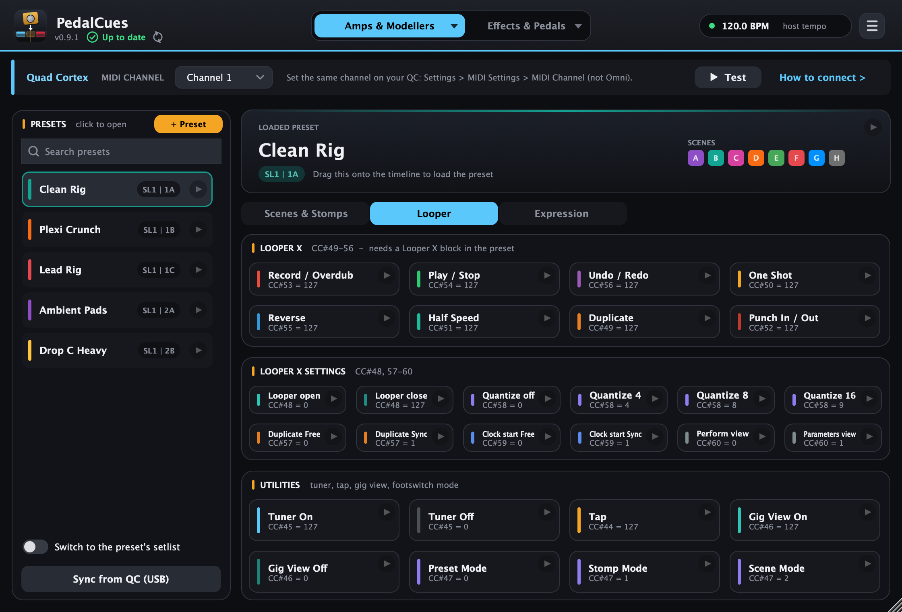

Click **Looper** under the screen for the Quad Cortex's **Looper X** (from the Quad Cortex and QC Mini manuals, CorOS 4.1.1). It only works when the loaded preset has a **Looper X block** on the grid.

- **Looper X:** **Record / Overdub** (CC#53), **Play / Stop** (CC#54), **Undo / Redo** (CC#56), **One Shot** (CC#50), **Reverse** (CC#55), **Half Speed** (CC#51), **Duplicate** (CC#49) and **Punch In / Out** (CC#52). Each clip works like pressing the button: drop *Record / Overdub* where recording starts and again where it should overdub, *Play / Stop* where it plays or stops.
- **Looper X settings:** open or close the Looper X screen (CC#48), **Quantize** off / 4 / 8 / 16 beats (CC#58), **Duplicate** Free or Sync (CC#57), **MIDI Clock Start** Free or Sync (CC#59), and the Perform or Parameters view (CC#60).
- The Utilities (tuner, tap, Gig View, footswitch mode) stay below, as on the other views.

The Looper view works on the [QC Mini](#quad-cortex-mini) too. Not tested on a Quad Cortex yet: if a tile doesn't do what it says, please tell us.

### Expression: swells, fades and wah

Click **Expression** under the preset screen. Its tiles move whatever you assign to an **expression pedal** on the Quad Cortex: a volume block for swells, a wah, a delay or reverb mix, drive, a filter. PedalCues sends `CC#1` (Expression 1) or `CC#2` (Expression 2), which is what the QC listens to for its expression pedals, so you don't need a physical pedal plugged in.

| Expression view | Draw your own |
|---|---|
|  |  |

**On the Quad Cortex (once per preset):** assign the parameter you want to move to **Expression 1** (or 2), the same way you would for a real expression pedal, and set its range: heel is the lowest setting, toe the highest. Save the preset; the assignment is stored in it.

**In PedalCues:**

- **Exp 1 / Exp 2** (header) picks which expression pedal the tiles move.
- **Set to** tiles put it at a fixed spot: **Heel**, **25%**, **Half**, **75%** or **Toe**. Drop one at the start of a song or right after a preset loads, so you always start from a known position.
- **Moves**, with a **Length** (1/16 to 4 bars) and a **Curve**, written in beats so they follow the project tempo:

| Move | What it does | Good for |
|---|---|---|
| **Swell In** | Heel to toe over the length | Volume swells, opening a filter |
| **Fade Out** | Toe to heel | Fading the end of a song, closing a delay |
| **Rise & Fall** | Heel to toe and back | A swell that dies away |
| **Slow Rise** | Barely moves at first, then rises quickly | Build-ups into a chorus |
| **Wah Rhythm** | Heel to toe and back on every beat | Rhythmic wah |
| **Rise to Bar** | Holds heel, then rises during the last beat | Opening up exactly on the downbeat |
| **Toe Down / Heel Down** | Jump there and hold | |

- **Draw** sketches your own move, the same way as the [Whammy's drawn moves](#draw-your-own-move), and you can save it in [My drawings](#my-drawings-save-and-reuse-your-moves), shared with the Whammy.
- **Back to heel after move** (off by default) puts the pedal back to heel when the move ends. Leave it off for a swell that should stay up.

**Which preset do they act on?** By default, the one the QC has loaded at that moment, like the Utilities: expression clips don't load a preset, and what a move does depends on that preset's own assignment (the same **Swell In** can swell the volume in one preset and open a wah in another). So place expression clips after the preset clip they belong to.

Switch on **Load 1A first** (right of the *Set to* tiles; it names the preset you have open, like the one in the Scenes header) to make every expression clip load that preset first and start its move 1/16 later, like scene tiles do. The clips are then named like `QC Clean Rig > Exp 1 Swell In 1 bar`. It's off by default because the QC may cut the sound for a moment when it reloads a preset.

> **If a preset might get changed by accident on stage** (a stray foot on the QC): keep scenes and stomps on **Load 1A first** (the default), so the next scene cue puts the right preset back. For an important expression move, either switch on **Load 1A first** in Expression, or drop a scene clip just before the move and a **Set to** tile (for example **Heel**) right after it. Listen for a short gap when the preset is re-sent; if your QC has a MIDI setting to ignore a repeated Program Change, turning it on avoids reloading a preset that's already loaded.

Expression clips go on the **QC Cues** track, like your other QC cues, and are named like `QC Exp 1 Swell In 1 bar`.

**Example: volume swells.** In a preset, add a **Volume** block after your drives (before delay and reverb, so the tails ring on) and assign its level to Expression 1 with the range from silent to full. In PedalCues, set *Length* to `2 beats` and drop **Heel** at the start of the passage, **Swell In** where you strike each chord, and **Heel** again just before the next chord. Play each chord while the volume is still at heel, and it fades in in time with the song.

> Don't let two expression clips on the same pedal overlap: both would send values and the setting would jump between them. If you also have a real expression pedal plugged in, the last value wins, so leave it alone while the clips play.

### Adding a preset by hand

1. Click **+ Preset**.
2. Type its name, setlist number, bank (1-32) and slot (A-H), exactly as the QC shows them. For example, *Setlist 1, bank 3, slot B* is shown as `SL1 | 3B`. A factory preset is setlist **0** (shown as `Factory | 3B`).
3. Click the preset in the list, then double-click each scene to give it the same name as on your QC.
4. Right-click a scene to give it the same colour you use on the pedal.

### Quad Cortex Mini

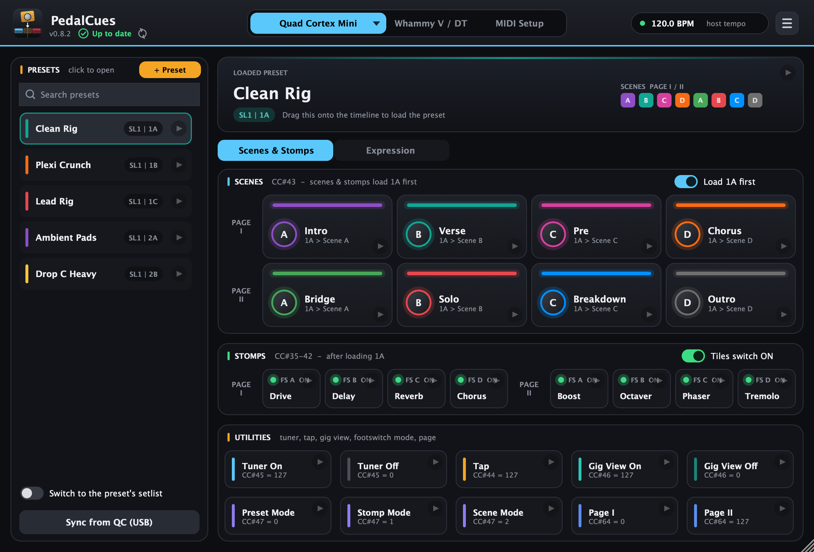

The QC Mini has four footswitches, A-D, on two **footswitch pages**. Each preset still has 8 scenes and 8 stomp assignments: Page II holds what the Quad Cortex has on E-H, so presets and MIDI are the same on both. Pick **Quad Cortex Mini** in the device list and the page shows them by page:

| Area | On the Mini | MIDI sent |
|---|---|---|
| **Scenes** | Two rows, labelled **Page I** and **Page II**, each with scenes A-D. A scene tile switches to its scene whatever page the Mini is showing. Clip names say the page, e.g. *QC Scene B (II)*. | `CC#43` = 0-3 (Page I), 4-7 (Page II) |
| **Stomps** | Footswitches A-D of **Page I**, then A-D of **Page II**. | `CC#35-38` (Page I), `CC#39-42` (Page II) |
| **Page I / Page II** (Utilities) | Shows that footswitch page on the Mini, like holding B. | `CC#64` = 0 / 127 |

Everything else (presets, setlists, Load 1A first, Looper, Expression, tuner, tap, Gig View, footswitch mode, Sync from QC) works as on the Quad Cortex. The Mini has one EXP jack; Expression 2 works over MIDI only. The numbers come from Neural DSP's QC Mini manual, which lists the same MIDI as the Quad Cortex's.

---

## 6. Kemper page


Pick **Kemper Profiler** (Head, Rack, Stage, Player... every Profiler model, in Performance mode) or **Kemper Player** with the **▾** on the first tab. The page works like the Quad Cortex page: a list on the left, a screen for the one you opened, and tiles below.

**Performances and slots:** a *performance* on the Kemper holds up to five *slots* (rigs), often one performance per song with a slot for each part, such as *Intro*, *Verse*, *Chorus*. On the **Kemper Player** the list is called **Banks** (10 banks of 5 slots, its 50 slots).

| Area | What it does | MIDI sent |
|---|---|---|
| **Performances** (left) | Your performances, with the number they have on the Kemper (1-125). **Search performances** at the top finds one fast. **+ Perf.** adds one; double-click to edit, right-click to recolour, reorder or delete. | |
| **Loaded performance** screen | The opened performance and its slot names. Drag it to load slot 1. | Bank select `CC#32`, then Program Change |
| **Slots** | Slots 1-5 of the open performance. Double-click to rename, right-click for a colour. | See below |
| **Load P1 first** (Slots header) | **On** (the default): a slot tile loads its performance and slot from anywhere. **Off**: it loads that slot of the performance the Kemper already has loaded. | On: `CC#32` + Program Change. Off: `CC#50-54` |
| **Effects** | Switch an effect module on or off: **A, B, C, D, X, MOD, DLY, REV**. **Tiles switch ON / OFF** picks which. **Keep tails** lets the delay and reverb ring out when they're switched off. | `CC#17-20`, `22`, `24`, `26/27`, `28/29` (value 1 = on, 0 = off) |
| **Utilities** | **Tuner On / Off**, **Tap x4** (four taps, one per beat, so tempo-synced delays follow the song), **Morph On / Off**, **Rotary Fast / Slow**. | `CC#31`, `CC#30`, `CC#80`, `CC#33` |
| **Slots & Effects / Pedals** | The switch under the screen picks what the lower part shows: slot and effect tiles, or pedal moves. | |

Clips are named like `Kemper Opener > 2 - Verse` (performance and slot) or `Kemper Slot 2 - Verse` (slot of the current performance).

**Program numbers:** in Performance mode, the Kemper counts its slots from Performance 1 Slot 1 upwards, 128 to a bank: PedalCues sends the bank (`CC#32`, 0-4) and the Program Change for you, so you only type the performance number. On the Kemper Player, the 50 slots are Program Changes 1-50.

### Pedals: wah, pitch, volume and morph


Click **Pedals** under the screen. The tiles move one of the Kemper's pedal inputs over MIDI, so you don't need a real pedal plugged in. Pick which in the header: **Wah** (`CC#1`), **Pitch** (`CC#4`), **Volume** (`CC#7`) or **Morph** (`CC#11`). The pedal moves whatever the rig on the Kemper assigns to it, like a real pedal would.

It works like the Quad Cortex's [Expression](#expression-swells-fades-and-wah): **Set to** tiles (Heel, 25%, Half, 75%, Toe), ready-made moves (Swell In, Fade Out, Rise & Fall, Slow Rise, Wah Rhythm, Rise to Bar, Toe Down, Heel Down) with a **Length** and **Curve**, **Draw** your own with [My drawings](#my-drawings-save-and-reuse-your-moves), and **Back to heel after move**. Pedal clips act on the slot the Kemper has loaded, so place them after the slot clip they belong to.

### Names and setup

Type the performance and slot names in PedalCues, as they're shown on the Kemper. Unlike the Quad Cortex, the Kemper can't send its performance names and colours to another program, so there's no sync. The Kemper's MIDI channel is at the top of its page: set the Kemper to the same fixed channel (it's *Omni* out of the box).

> Tested against Kemper's MIDI documentation, not on a real Kemper yet. If something doesn't switch as expected, please [tell us](https://github.com/thankost/pedal-cues/issues/new?template=problem.yml).

---

## 7. Fractal, Line 6, HeadRush, Darkglass and more (beta)

| Helix Floor | Axe-Fx II |
|---|---|
|  |  |

These units have their MIDI numbers defined, by Line 6, HeadRush, Darkglass and Neural DSP or as Fractal's factory defaults, so each gets a page like the Quad Cortex: your presets in a list, scenes or snapshots named per preset, and the unit's own footswitches or blocks, utilities, looper and expression. Pick yours from the device list (the **▾** on the first tab; type to search).

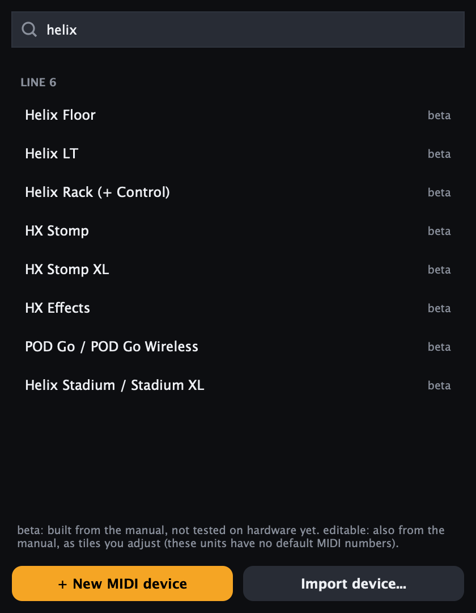

| Line 6 | Fractal Audio | HeadRush | Darkglass | Neural DSP |
|---|---|---|---|---|
| Helix Floor, Helix LT, Helix Rack (+ Control), HX Stomp, HX Stomp XL, HX Effects, POD Go / POD Go Wireless, Helix Stadium / Stadium XL | Axe-Fx II / XL / XL+, AX8, FX8 (Mark I / II) | Core, Prime, Flex Prime, Pedalboard, Gigboard, MX5 ([details](#headrush-beta)) | Anagram ([details](#darkglass-anagram-beta)), Infinity 500 Combo, Exponent 500 ([details](#darkglass-infinity-500-combo-and-exponent-500-beta)) | Nano Cortex ([details](#nano-cortex)) |

The Axe-Fx III, FM9, FM3 and VP4 have no default MIDI numbers, so they come as [templates](#templates-beta) instead.

> **Built from the manuals, not tested on hardware.** Every number on these pages comes from the manufacturer's manual (Line 6 firmware 3.80, POD Go 2.50 and Stadium manuals; Fractal owner's manuals). The page says so next to the view switch, and **About this unit** gives the manual, what to check and the unit's connection facts. Please [tell us](https://github.com/thankost/pedal-cues/issues/new?template=problem.yml) what works on your unit.

**Presets:** click **+ Preset** and enter it the way your unit shows it: Helix *USER 1 > 01A*, HX Stomp *01A-42C*, Axe-Fx II bank *A-F* + *000-127*, AX8 *01:1*, FX8 *A1*. **Search presets** finds one fast. On units with setlists (Helix, POD Go, Stadium), **Switch to the preset's setlist** (under the list) makes each preset also select its setlist (CC#32). It's off by default, like the Quad Cortex's, and a **Setlists not sent: turn on** button appears when your presets are in more than one setlist.

**Scenes / snapshots:** named per preset, like the QC's scenes. With **Load (preset) first** on (the default), a tile loads its preset first:
- **Line 6:** the snapshot goes out with the preset. Line 6 documents that a snapshot sent during a preset load waits until the preset has loaded.
- **Fractal:** the scene follows 1/16 later, like on the QC.

**The views:**

| View | Line 6 | Fractal (Axe-Fx II, AX8, FX8) |
|---|---|---|
| **Scenes & Switches** | Snapshots (CC#69); footswitches (Helix CC#49-58 press FS1-FS5 and FS7-FS11: no CC for FS6 or FS12; HX Stomp FS4/FS5 = external switches; Stadium: footswitch mode, CC#37); tuner, tap, next/previous preset, All bypass (HX) | Scenes (CC#34); blocks on/off with **Tiles switch ON/OFF** (Amp, Cab, Drive, Delay, Reverb...); tuner, tap, next/previous scene |
| **Looper** | Record/overdub, play/stop, play once, undo, direction, speed, looper on/off | Record, play, once, dub, reverse, half speed, undo |
| **Expression** | EXP 1-2 (EXP 3 on Helix Floor and Rack): Set to tiles, swells, fades, wah and drawn moves | External controllers (Axe-Fx II and FX8: 1-4 = CC#16-19; AX8: 5-8 = CC#20-23): used by a preset's modifiers |

**Good to know:**
- The **Helix tuner** and **tap** tiles act on any value: each tuner clip toggles the tuner, and one tap tile is one tap (drop it on each beat).
- **HX Stomp:** the manual says three snapshots per preset (its MIDI table also lists a fourth value); the page uses three.
- **POD Go** takes MIDI over USB only: no 5-pin MIDI, so no daisy chain.
- **Helix Stadium** uses a different MIDI map from older Helix units, and a second MIDI channel for block bypass that this page doesn't cover. With MIDI Over USB C on, its MIDI Thru also passes on USB MIDI.
- **Fractal** pages use the **factory default** CCs. If you changed them on your unit, use a [custom MIDI device](#8-custom-midi-devices-beta) instead. On the Axe-Fx II, "Ignore Redundant PC" is off by default, so loading the preset that's already loaded reloads it. MIDI over USB reaches the 5-pin MIDI Out only with USB Adapter Mode on.

### HeadRush (beta)

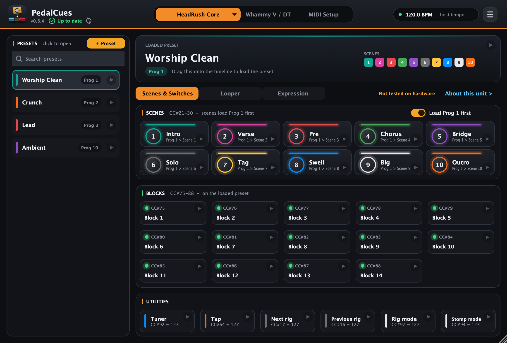

HeadRush publishes one fixed MIDI map, so each unit gets a page. It works a little differently from the others:

- **Presets are your rigs' MIDI PROG numbers.** HeadRush has no bank select or setlists over MIDI: each rig has a **MIDI PROG** number that you set in the rig's settings. Set it on the rig, then enter the same number in PedalCues (**+ Preset**). Core, Prime and Flex Prime show it as 1-128, Pedalboard, Gigboard and MX5 as 0-127; the page uses the numbers your unit shows. Turn **Prog Change Recv** on in the unit's Global Settings > MIDI.
- **Scenes** (Core 10, Prime 8, Flex Prime 6): each scene has its own CC, from CC#21. With **Load (preset) first** on, the scene follows the rig 1/16 later. Pedalboard, Gigboard and MX5 have no scenes over MIDI, so their page shows blocks only.
- **Blocks:** Block 1-14 (11 on Pedalboard, Gigboard and MX5), CC#75 and up, as numbered in the rig. HeadRush only **toggles** a block: each clip turns it on if it was off and off if it was on. Rename the tiles after your blocks.
- **Utilities and looper:** tuner (CC#92, toggles; not on Pedalboard, Gigboard or MX5), tap, next / previous rig, Rig and Stomp footswitch modes; looper record, start/stop, insert, peel, mute, reverse, speed and length.
- **Expression:** Core CC#1 (external pedal); Prime and Flex Prime CC#1 (built-in) and CC#2 (external).
- The **footswitch CCs** aren't tiles: they do whatever each footswitch does in the current mode, and need a press and a release.
- **Connection:** use a MIDI cable from your interface. The manuals don't mention MIDI over USB from a computer, so the wiring guide shows MIDI cables only. Flex Prime and MX5 have 3.5 mm TRS MIDI jacks (Type A): use a TRS MIDI cable or a 5-pin to TRS adapter.

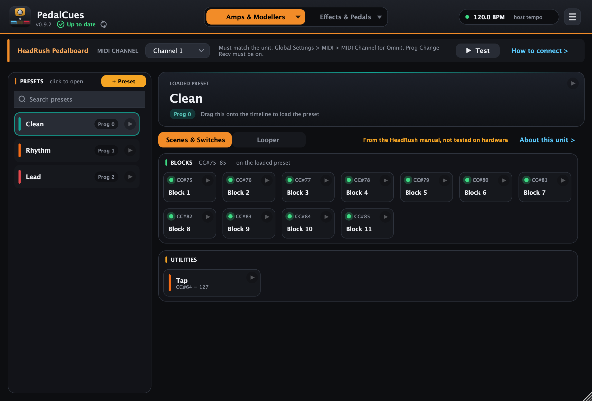

### Darkglass Anagram (beta)

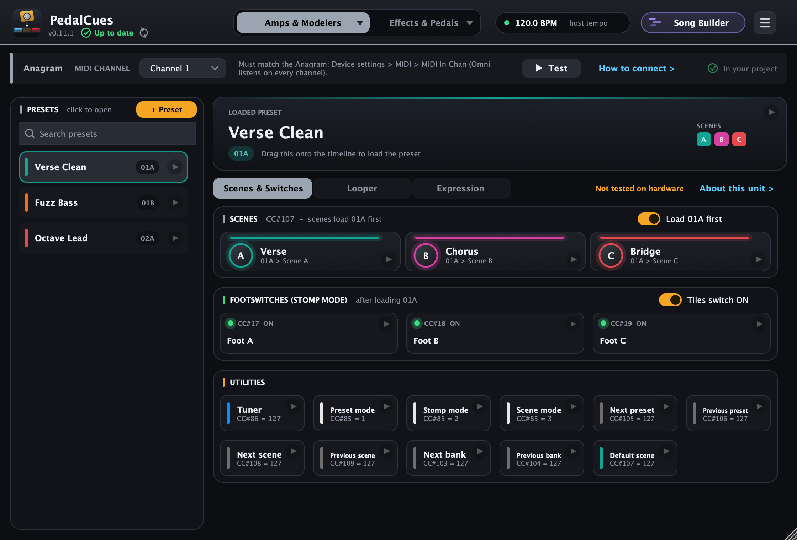

Built from the Anagram manual (KosmOS 1.17, *MIDI Support*). Darkglass says its MIDI is still being developed, so newer firmware may add more.

- **Presets:** 01A-42C, loaded with a Program Change. The Anagram ignores value 0, and its *MIDI Style* numbering (001-126) matches the Program Change, so **01A = Program Change 1**. If 01A doesn't load on your unit, please tell us.
- **Scenes A-C** (three per preset): CC#107 = 1, 2, 3. The manual's table lists values 1-126; PedalCues sends 1-3 for the open preset. Tell us if your Anagram needs something else.
- **Footswitches A-C** (the Stomp mode bindings): CC#17-19, ON or OFF with the header switch. With the Anagram's *Toggle Logic* setting on *Value* (the default), 0-63 = off and 64-127 = on.
- **Utilities:** tuner (CC#86), Preset / Stomp / Scene mode (CC#85 = 1 / 2 / 3), next / previous preset and scene. **Looper:** play/stop, rec/dub, undo, redo, clear slot and the looper screen (CC#110-115).
- **Expression:** the expression pedal binding (CC#89) and knob bindings 1-6 (CC#20-25). The footswitch, knob and expression numbers are the *default* binding CCs; if you changed them (*Bindings > Edit CCs*), use a custom MIDI device.
- **Connection:** 3.5 mm TRS MIDI In and Out (Type A) and USB MIDI (turn *USB MIDI* on). Set *MIDI In Chan* to the channel at the top of its page.

### Darkglass Infinity 500 Combo and Exponent 500 (beta)

| Infinity 500 Combo | Exponent 500 |
|---|---|
| 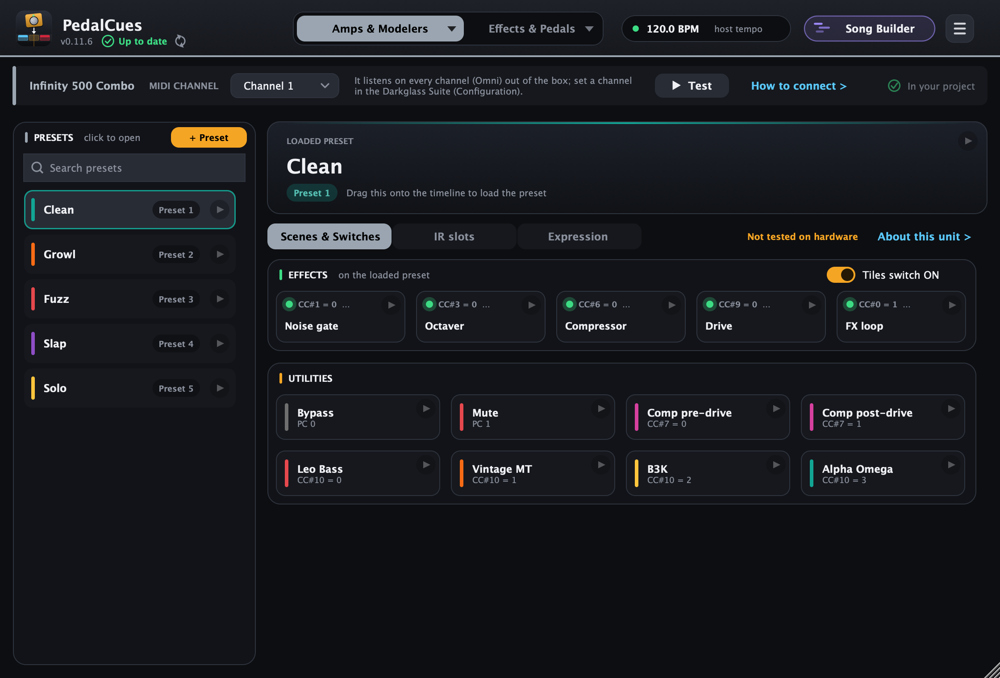 | 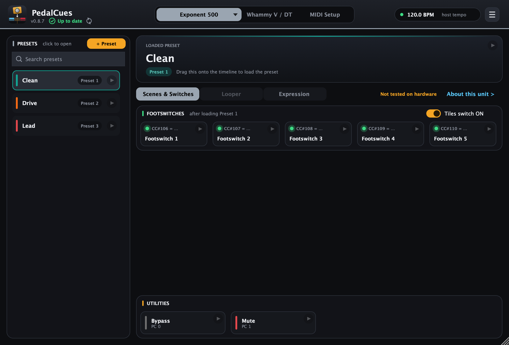 |

Both amps' manuals publish a default MIDI mapping, so they get pages. If you changed the mapping or the switch type in the Darkglass Suite, use a custom MIDI device instead.

- **Presets 1-5** = Program Change 2-6. **Bypass** (PC 0) and **Mute** (PC 1) are in Utilities.
- **Infinity 500 Combo:** *Effects* switches the noise gate, octaver, compressor, drive and FX loop on or off. Utilities have the compressor position and the four drive modes (Leo Bass, Vintage Microtubes, B3K, Alpha Omega). The second view is **IR slots** (IR bypass, slots 1-7). The Expression view moves drive amount, tone, blend and level, the compressor, octaver and gate, the tweeter, the six EQ sliders and the preset level.
- **Exponent 500:** *Footswitches* 1-5 (CC#106-110) switch the effect bypasses bound to each Darkglass MIDI Footswitch button in the preset. The Expression view moves Quick-Pots A-E (CC#0-4) and the master volume (CC#5).
- **Switch values:** both use the *Per-value* switch type by default, so the effects send **0 = on, 1 = off** (the tiles show the value), the FX loop 1 = on, 0 = off.
- **Connection:** the back-panel MIDI In takes a 5-pin cable (the 7-pin connector is only for the Darkglass MIDI Footswitch), or USB MIDI. They listen on every channel (Omni) out of the box. Neither has a MIDI Out, so a second pedal needs its own output.

The **Microtubes Infinity** pedal has a [template](#templates-beta) from a community chart. The **ADAM** and **Alpha·Omega Photon** pedals take MIDI (TRS Type B, USB), but Darkglass publishes no MIDI chart for them, so use a custom MIDI device and its manual or the Darkglass Suite.

### Nano Cortex

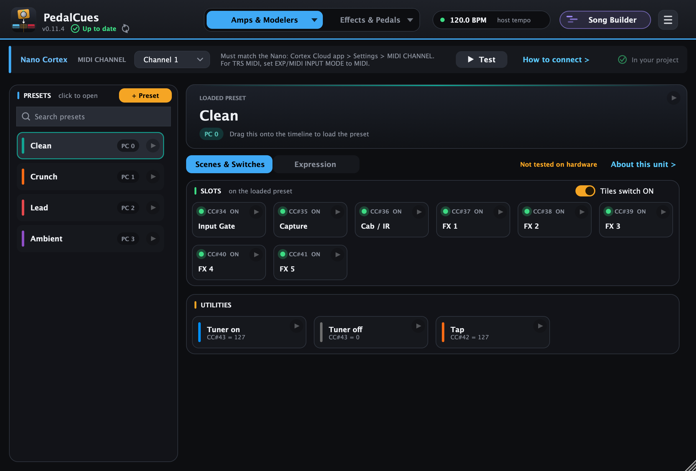

Built from the Nano Cortex User Manual 2.2.0 (*Incoming MIDI CC List*). Pick **Nano Cortex** under *Neural DSP* in the device list.

- **Presets:** the 64 slots under *ALL PRESETS* are **Program Change 0-63** (the app's *PC/CC* button shows the numbers). No banks, setlists or scenes over MIDI.
- **Slots:** Input Gate, Capture, Cab/IR and FX 1-5 on or off (CC#34-41).
- **Utilities:** tuner on / off (CC#43) and tap (CC#42). **Expression:** CC#1, with the shapes, Set to tiles, Draw and Wave. There's no looper over MIDI.
- **Connection:** USB-C MIDI, or **TRS MIDI Type A** into the **EXP/MIDI** jack: set *EXP/MIDI INPUT MODE* to *MIDI* in the Cortex Cloud app (then the jack can't take a real pedal, which is where the Expression view helps). Set *MIDI CHANNEL* there to the channel at the top of its page.
- The Nano has **no MIDI Out**, so it can't pass MIDI on to a second pedal: give a Whammy or other pedal its own MIDI output (the wiring guide shows *Separate outputs*).

---

## 8. Custom MIDI devices (beta)


Not on a Quad Cortex, Kemper or one of the [Fractal, Line 6 and HeadRush pages](#7-fractal-line-6-headrush-darkglass-and-more-beta)? **Any device that takes MIDI works**, including units where you set up the MIDI mapping yourself:

- **Templates** give you a head start for units with their own MIDI mapping: the [Axe-Fx III, FM9, FM3, VP4, Boss GT-1000 and Darkglass Microtubes Infinity](#templates-beta) come with tiles from their manuals (or a community chart) and notes on what to set on the unit.
- **Anything else** (another Boss, a synth, a looper, a lighting controller): make the tiles yourself, once, from the device's MIDI chart.

Either way it's an ordinary MIDI device you can edit, give [expression moves](#expression-moves-on-any-device) and share.

**Make one:** click the **▾** on the first tab (or click the open tab again) and choose a template (an [Axe-Fx III, FM9, FM3, VP4, Boss GT-1000 or Microtubes Infinity](#templates-beta)) to start from its manual, or click **+ New MIDI device** under the list and give it a name: it starts with example tiles to edit, and the tab takes its name. **Import device...** next to it adds one from a file.

**The device card (left):**
- **Name:** double-click to rename. The **...** menu has rename, colour, duplicate, delete and **New MIDI device**.
- **Programs count from 0 / 1:** how the device's manual numbers presets. Some count the first preset as 0, others as 1; Program Change tiles use the same counting.
- **Notes:** anything worth remembering: which manual page the numbers come from, and why it's set up this way. Notes travel with the device when you share it.
- **Export device... / Import device...:** save the device (groups, tiles, notes and its expression CC) as a `.pedalcues-device` file, to back it up or share it. One person sets up a device and everyone with the same gear imports it.

**Search tiles** (above the groups) finds a tile by its name, messages, note or group; groups without a match are hidden while you search.

**Groups and tiles (right):** name groups however your device works, for example *Presets*, *Scenes*, *Snapshots* or *Switches*. **+ Group** adds one, **+ Tile** adds a tile to a group, and each group's **...** renames, moves or deletes it. Tiles drag, play and right-click like every other tile; a clip is named after the device and the tile, for example `My Rig Verse`.

### Expression moves on any device

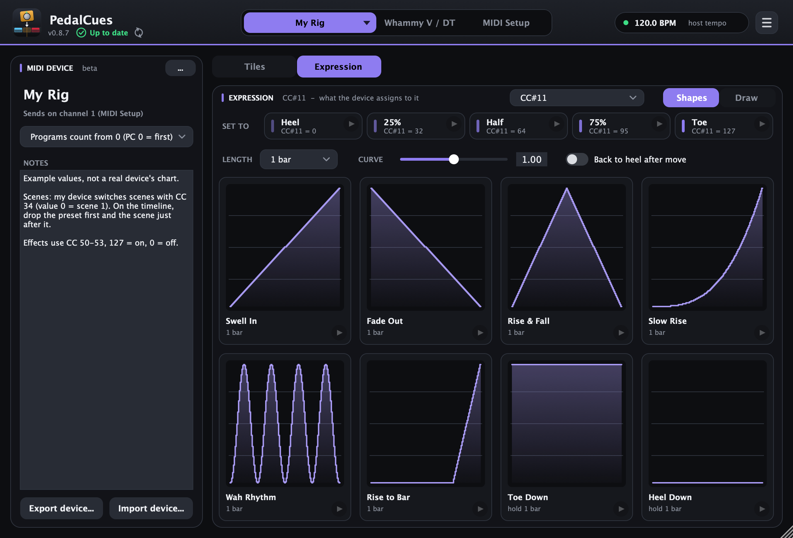

Switch the right side from **Tiles** to **Expression** for pedal moves on your device: the same swells, fades, rise & fall, wah rhythm and drawn moves as on the Quad Cortex page, plus **Set to** tiles (heel, 25%, half, 75%, toe). They're tempo-synced Control Change curves, so they work with anything that takes a CC.

- **Pick the CC** in the box at the top: the one your device's expression pedal listens to, or the one you assigned to a parameter on the device (its manual says how; on many units it's an "assign" with a MIDI CC as the source). **CC#11** is the MIDI standard Expression controller and the default. The CC is saved with the device, so it travels when you share it.
- **Length**, **curve** and **Back to heel after move** work as on the other pages, and **Draw** saves your own moves to [My drawings](#my-drawings-save-and-reuse-your-moves), shared by every page.

### The tile editor


**+ Tile** or a double-click opens the editor:

- **Start from** fills in a typical tile to adjust: **Preset** (one Program Change), **Bank + preset** (bank select, then the Program Change, for devices with more than 128 presets), **Switch on/off** (one Control Change, 127 = on, 0 = off) and **Set a value** (one Control Change with the value from the device's chart).
- **MIDI messages:** one row per message, sent together in order. Pick **Program Change**, **Control Change** or **Bank select (CC#0)**, then set the numbers with **−** / **+** (or drag them). Control Changes have **On** (127) and **Off** (0) buttons. **×** removes a row; **+ Add message** adds one.
- The line under the messages says in plain words what the tile sends, for example *"On channel 1: select bank 1, then load program 5."*
- **Note** (optional) shows in the tile's tooltip.
- **Test on the device** sends the messages before you save.

**A preset, then a scene:** drop the preset tile first and the scene tile just after it on the timeline, so the device has loaded the preset before the scene arrives.

### Templates (beta)

Some units have no fixed MIDI numbers: you set up the mapping on the unit, so the numbers differ from player to player. For those, PedalCues has **templates**: pick one in the device list (marked *template*) and you get an ordinary MIDI device filled with tiles from the manual, plus **About this unit** with what to set on the unit. Adjust the tiles to your numbers, add your own, and share it.

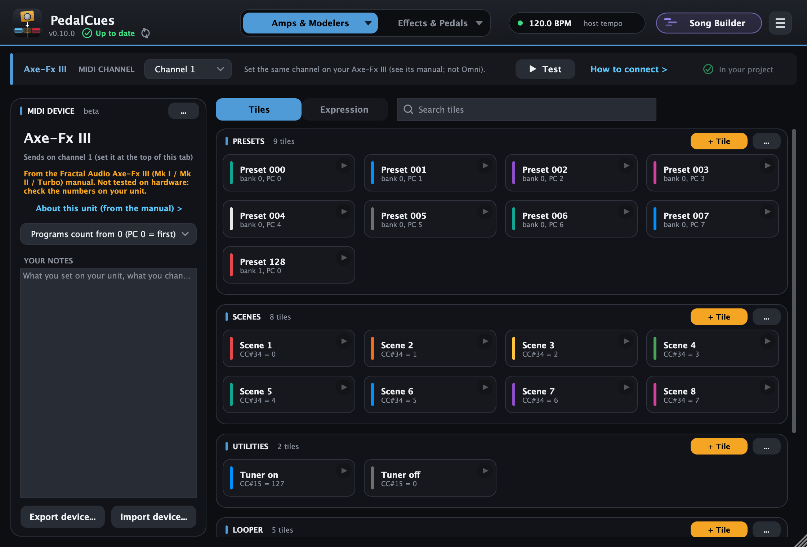

These four Fractal units have **no default MIDI CCs**: you assign scene select, tuner and the rest on the unit (*SETUP > MIDI/Remote*), so the numbers differ from player to player. That's why they come as **editable MIDI devices** rather than a page like the [Axe-Fx II](#7-fractal-line-6-headrush-darkglass-and-more-beta). Pick one from the device list and it arrives filled with tiles from its manual: presets (CC#0 bank + Program Change, ready to use) and scenes, tuner and looper with *suggested* numbers (the Axe-Fx II's old defaults: Scene Select 34, Tuner 15, looper 28-32). Set the same numbers on the unit, or change the tiles to yours.

- **FM3:** it can't be controlled over USB MIDI (Fractal: "unpredictable behavior"). Use a 5-pin MIDI cable.
- **VP4:** 104 presets (A1-Z4), 4 scenes (the tiles use CC#17, the manual's example). MIDI is on 3.5 mm TRS jacks: you need a Type A adapter.

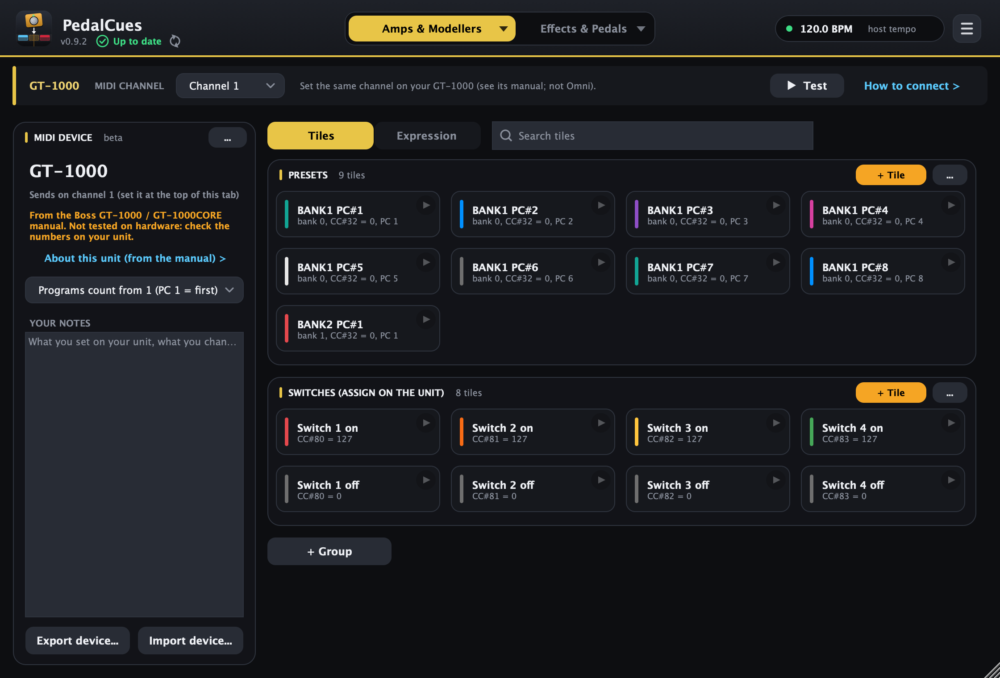

**Boss GT-1000 / GT-1000CORE:** it has no fixed MIDI CCs either: it reacts to a CC only through an **ASSIGN** that uses it as its source (CC#1-31 or CC#64-95), and which patch a Program Change loads is set in its **PROGRAM MAP**. The template is set up for that:
- **Presets:** on the GT-1000, set *MENU > MIDI > MAP SELECT* to **PROG** and fill *PROGRAM MAP BANK1* (PC#1, PC#2... = the patches you want). The tiles **BANK1 PC#1**, **PC#2**... load those (bank select CC#0 and CC#32 = 0, then the Program Change, counted from 1 like the GT-1000). Rename them after your patches.
- **Expression:** switch the device to [Expression](#expression-moves-on-any-device); it starts on **CC#11**. On the GT-1000, make an ASSIGN with *SOURCE* = CC#11 and the *TARGET* you want to move (foot volume, a wah, a delay level...), ACT LOW 0, ACT HIGH 127.
- **Switches:** *Switch 1-4 on / off* send CC#80-83 = 127 / 0. Make an ASSIGN for each with *SOURCE* = that CC, *MODE* = MOMENT, and the target (an effect's on/off).
- Set *RX CHANNEL* (MENU > MIDI > MIDI SETTING) to the channel at the top of the device's PedalCues page.

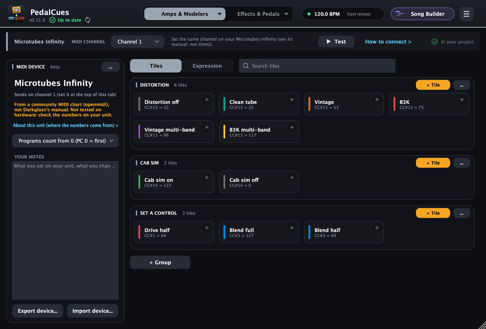

**Darkglass Microtubes Infinity:** Darkglass doesn't publish its MIDI chart, so this template comes from a **community chart** (Morningstar's openmidi database), and the card says so. It has no preset tiles, because no Program Changes are documented.
- **Tiles:** distortion mode (CC#13: off, clean tube, Vintage, B3K and the multi-band versions), cab sim on / off (CC#14, assumed 0 = off, 127 = on), and a few set-value tiles. **About this unit** lists every control: Compression CC#0, Drive 1, Character 2, Blend 3, Level 4, headphones 5, EQ sliders 6-11, compression ratio 12.
- **Expression** starts on Drive (CC#1); pick any other control there for moves.
- **Its MIDI jack is TRS Type B**, unlike the Type A on most gear: use a Type B cable or adapter (or a controller that switches to Type B). USB MIDI works too.
- CC#0 is a control here (Compression), not bank select, so PedalCues never adds a spare CC#0 to this device's clips.
- The device card says in amber that the numbers come from the manual, not tested on hardware. **About this unit (from the manual)** shows what to set and check; it's kept by PedalCues (updates keep it current), while **Your notes** below it are yours to write.

> Custom MIDI devices are a **beta**: tell us what your device needs, or share a device file, in a [GitHub issue](https://github.com/thankost/pedal-cues/issues/new?template=idea.yml).

---

## 9. Build a song, step by step

This example covers a song with a clean verse, a crunchy chorus and a Whammy solo.

1. **Load the preset at bar 1.** Click *Clean Rig* in the list, then drag the **Loaded preset** screen to bar 1.
2. **Set the intro scene.** With **Load 1A first** on (the default), dragging the **Intro** scene tile to bar 1 loads the preset and the scene in one clip. With it off, drag the preset first, then the scene just after it.
3. **Mark every section.** Drag **Verse** to bar 3, **Chorus** to bar 9, **Solo** to bar 13, and so on. Each clip is named after the scene, so the arrangement reads like a setlist.
4. **Whammy mode for the solo.** On the Whammy tab, drag **Oct Up** to one beat before the solo.
5. **Treadle move.** Set *Length* to `2 bars`, then drag **Rise & Fall** to the bar where the bend starts.
   Optional: for a delay that swells into the last chorus, assign the delay's mix to Expression 1 on the QC, then drag **Swell In** (Quad Cortex page > **Expression**) a few bars before it.
6. **Test.** Press play in your DAW and watch the QC and the Whammy follow. To check a single cue, click its tile's play button.
7. **Tuner between songs.** Drop **Tuner On** at the end of the song and **Tuner Off** before the next one.

> Clips are ordinary MIDI items. You can move, copy, split or delete them like any other item. Their names come from your tiles, so renaming a scene before you drag it keeps the timeline readable.

---

## 10. Effects & Pedals: Whammy V / DT, DL4 MkII, HX One and your devices

The first tab, **Amps & Modellers**, is for your amp modeller; the second, **Effects & Pedals**, for a pedal next to it. New setups start with **No pedal** there; click the **▾** on the tab (or the tab itself again) to pick yours:

| The Effects & Pedals list | A MIDI device there | Only one device |
|---|---|---|
| 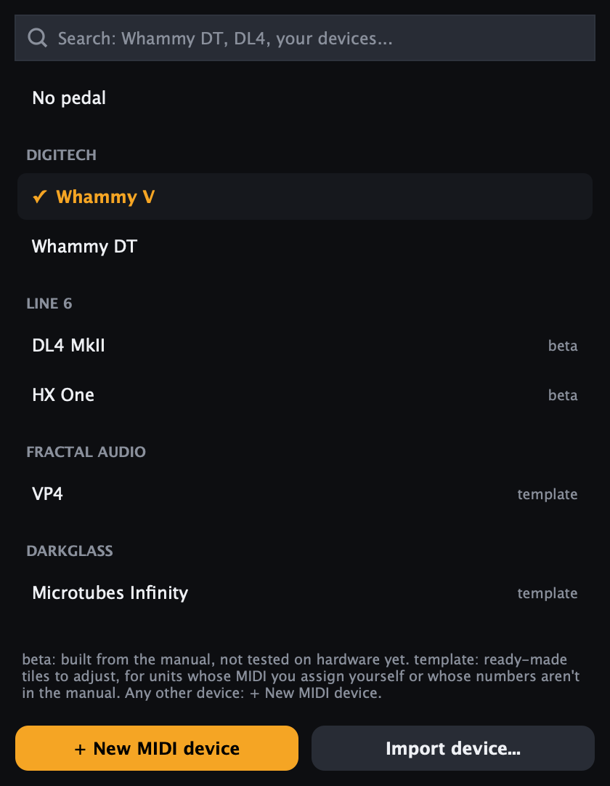 | 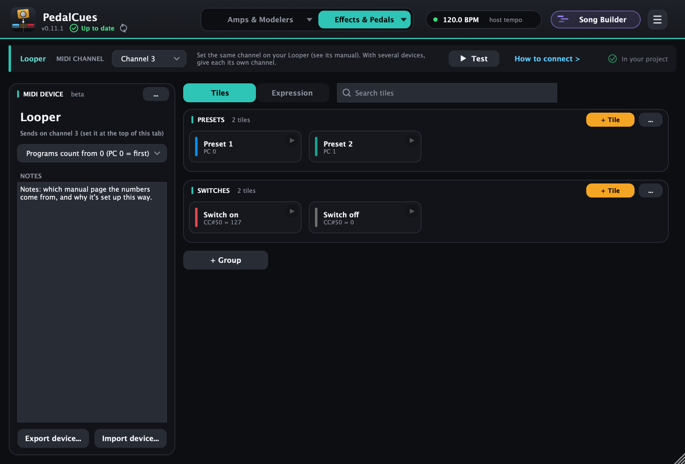 | 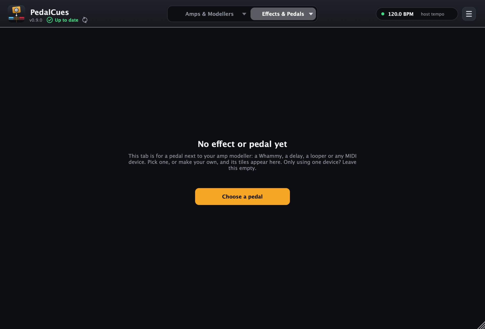 |

- **No pedal:** only using one device? Pick this and the tab shows how to add one later; How to connect then shows one device and one cue track. New setups start with No pedal.
- **Whammy V** and **Whammy DT** (DigiTech): two devices sharing one page, described below. The DT adds Drop Tune and has no Chords.
- **Line 6 DL4 MkII** and **HX One** (beta): ready-made pages, [below](#line-6-dl4-mkii-and-hx-one-beta).
- **Templates** for effect pedals: the Fractal **VP4** and the Darkglass **Microtubes Infinity** ([templates](#templates-beta)). Templates for amp modellers stay in the Amps & Modellers list.
- **Your MIDI devices:** any [custom MIDI device](#8-custom-midi-devices-beta) (a delay, a looper, a synth...), with its tiles and expression moves, or **+ New MIDI device** / **Import device...** under the list. A device belongs to one tab: to move it, use **Move to Amps & Modellers** (or **Move to Effects & Pedals**) in the device's **...** menu.
- The tab takes the pedal's name and colour. Each pedal keeps **its own MIDI channel**, set at the top of its page and saved with your setup.

Switching pedals doesn't change clips already on the timeline: each keeps the pedal and channel it was dragged with.

### Line 6 DL4 MkII and HX One (beta)

| DL4 MkII: Controls | DL4 MkII: Models | HX One |
|---|---|---|
| 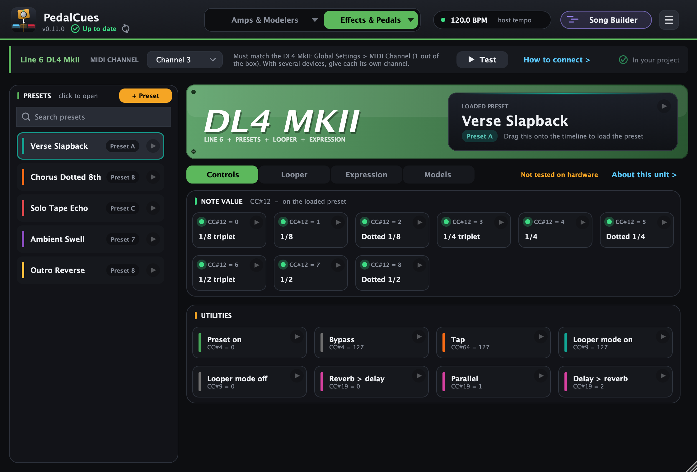 | 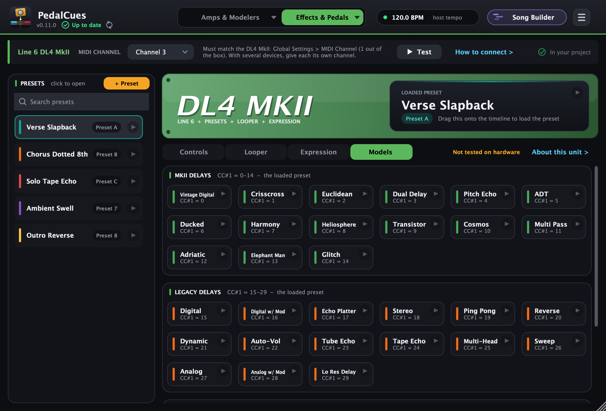 | 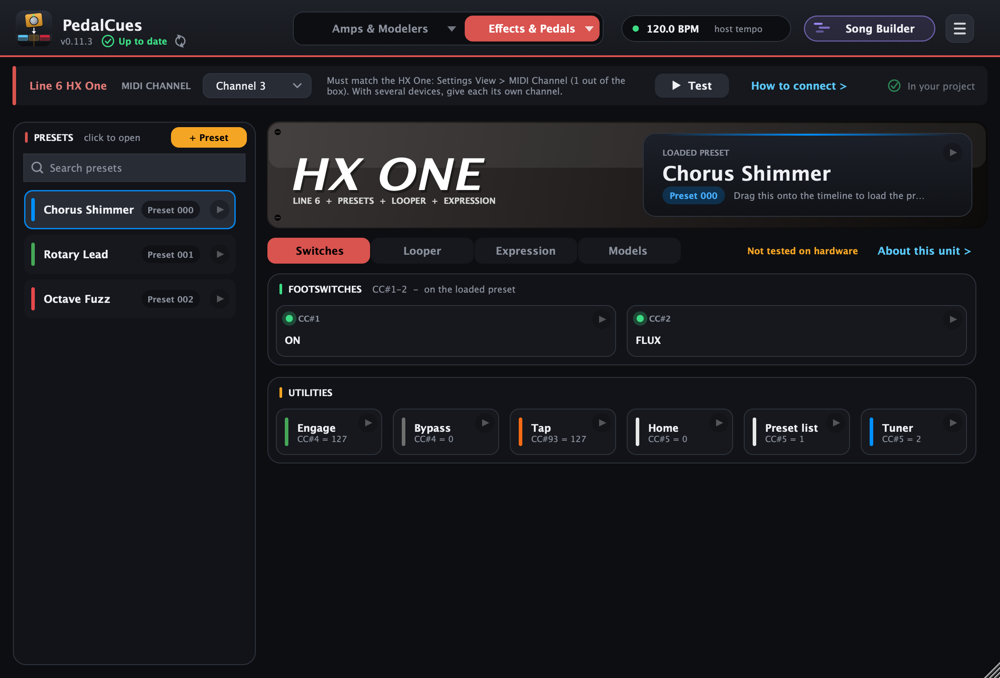 |

Laid out like the [Fractal and Line 6 pages](#7-fractal-line-6-headrush-darkglass-and-more-beta), built from Line 6's owner's manuals and not tested on hardware yet (**About this unit** lists every number):
- **DL4 MkII:** presets **A-F** (Program Change 0-5) and **7-128** (PC 6-127, only reachable over MIDI). **Controls:** the delay's note value (CC#12), preset on / bypass, tap, Classic Looper mode on / off and the reverb-delay routing. **Looper:** record, overdub, play, stop, play once, undo, redo, reverse, half speed (CC#60-66). **Expression:** the expression pedal (CC#3; make the assignment first with a pedal on the EXP PEDAL jack) and the knobs (time, repeats, tweak, tweez, mix, reverb decay, predelay and mix). **Models:** the 15 MkII and 15 Legacy delays (CC#1) and the 15 secret reverbs plus Reverb off (CC#2) of the loaded preset. Changing a model clears the preset's pedal assignments, as on the pedal.
- **HX One:** presets **000-127** (PC 0-127). **Switches:** ON (toggles) and FLUX; Engage / Bypass, tap (CC#93, as in the manual's table), Home, Preset List and Tuner. **Looper** (Simple Looper models) and **Expression** on the pedal (CC#3, with Pedal Jack set to ExpFS4), parameters 1-24 and the FLUX times.
- Both use MIDI channel 1 out of the box, the same as most amp modellers: set the pedal to another channel (PedalCues suggests 3) and pick the same at the top of its page. The DL4 MkII's MIDI Thru is off out of the box; turn it on in its Global Settings if another device is after it.

Switching pedals doesn't change clips already on the timeline: each keeps the pedal and channel it was dragged with.


PedalCues works with the **DigiTech Whammy V** (5th generation) and the **Whammy DT**. Pick **Whammy V** or **Whammy DT** in the tab's list (the **▾**). The red faceplate then shows the pedal's name, and on the DT the [Drop Tune](#whammy-dt-drop-tune) tiles appear. Your choice is saved with your setup (*Save as default setup*, *Export setup*).

### Modes

The 21 Whammy modes are laid out like the pedal's panel (the Whammy DT has the same modes on its left knob):
- **Top row:** the **Whammy** modes, from 2 Oct Up to Dive Bomb.
- **Middle row:** each **Harmony** mode sits right below the Whammy mode that shares its row on the pedal (Oct Up/Oct Down below 2 Oct Up, and so on).
- **Bottom row:** **Detune** Shallow and Deep, on their own row as at the bottom of the pedal.

Colours match the pedal: **Whammy** (red), **Harmony** (green), **Detune** (blue). Each tile shows its Program Change number from the DigiTech manual. Drag a mode tile to switch the Whammy.

- **...** (Modes header): **Program numbering**. Leave it on *As printed in the manual (1 = first)*; switch to *Zero-based* only if every mode lands one position off on your Whammy.
- **Chords** (Whammy V only): uses the polyphonic *Chords* program range (43-84) instead of *Classic* (1-42). The Whammy DT has no Chords mode, and on the DT those numbers select Drop Tune, so the switch is hidden there.
- **Load bypassed:** selects the mode without engaging the effect. The tile LEDs go dark to show this.
- **Heel first:** sends `CC#11 = 0` before switching, so the new mode starts from heel with no pitch jump.

### Whammy DT: Drop Tune


On the Whammy DT, the Modes card has a **Whammy | Drop Tune** switch. **Drop Tune** shows the pedal's right knob as two rows of tiles:

- **Shift Up** (raise your tuning): +1 to +7 semitones, +Oct, and +Oct + Dry (an octave up mixed with your dry signal, a 12-string sound).
- **Shift Down** (drop your tuning): -1 to -7 semitones, -Oct and -Oct + Dry. For example, **-1** gives E-flat tuning and **-2** a whole step down.

Drop one where the new tuning starts, for example **-2** at the start of a song in D standard. With *Load bypassed* on, a tile picks the shift but leaves it off (its LED goes dark), ready to switch on later. Drop Tune can be combined with a Whammy, Harmony or Detune mode, like on the pedal, so you can tune down and still bend with the treadle.

| Drop Tune | 1 | 2 | 3 | 4 | 5 | 6 | 7 | Oct | Oct + Dry |
|---|---|---|---|---|---|---|---|---|---|
| Shift Up, on | 43 | 44 | 45 | 46 | 47 | 48 | 49 | 50 | 51 |
| Shift Up, bypassed | 61 | 62 | 63 | 64 | 65 | 66 | 67 | 68 | 69 |
| Shift Down, on | 60 | 59 | 58 | 57 | 56 | 55 | 54 | 53 | 52 |
| Shift Down, bypassed | 78 | 77 | 76 | 75 | 74 | 73 | 72 | 71 | 70 |

These are the Program Change numbers from the Whammy DT manual. The DT's **Momentary** footswitch has no MIDI message, so it can't be sent from a clip; drop a shift tile where it should start and the same tile with *Load bypassed* where it should stop.

### Treadle moves


Treadle moves are **CC#11** automation written in beats, so they follow your project tempo. Each tile shows its curve. You can also [draw your own](#draw-your-own-move).

| Move | What it does |
|---|---|
| Ramp Up / Ramp Down | Heel to toe, or toe to heel, over the length |
| Rise & Fall | Heel to toe and back |
| Dive | Slow start, then accelerates to toe (try it with *Dive Bomb*) |
| Trill | Toggles heel/toe on 1/16 notes |
| Bend to Bar | Holds heel, then bends in the last beat so it lands on the next bar line |
| Toe Down / Heel Down | Jumps and holds |

- **Length:** from 1/16 note up to 4 bars.
- **Curve:** `1.00` is linear, lower values start fast, higher values start slow.
- **Return to heel after move:** adds a `CC#11 = 0` at the end.

### Draw your own move


When no ready-made shape fits, click **Draw** in the *Treadle moves* header.

1. **Pick the length** first. The pad's grid shows beats, with brighter lines on each bar.
2. **Drag across the pad** to draw the treadle: bottom is heel, top is toe. Draw over any part again to fix it. Hold **Shift** to snap to heel, quarter, half, three-quarter or toe.
3. **Clear** resets the pad to heel. **Smooth** rounds off sharp edges; click it again for a softer curve.
4. **Drag the *Drawn move* tile** onto the timeline where the move should start, or click its play button to try it on the pedal.

The drawing stretches to whatever *Length* you pick. *Return to heel after move* works here too; *Curve* only applies to the shapes, so in Draw mode its place holds **Wave...**. Click **Shapes** to go back to the ready-made moves.

#### Wave...: generate a wobble, a trill or a build-up

| Generated wave | The Wave panel |
|---|---|
| 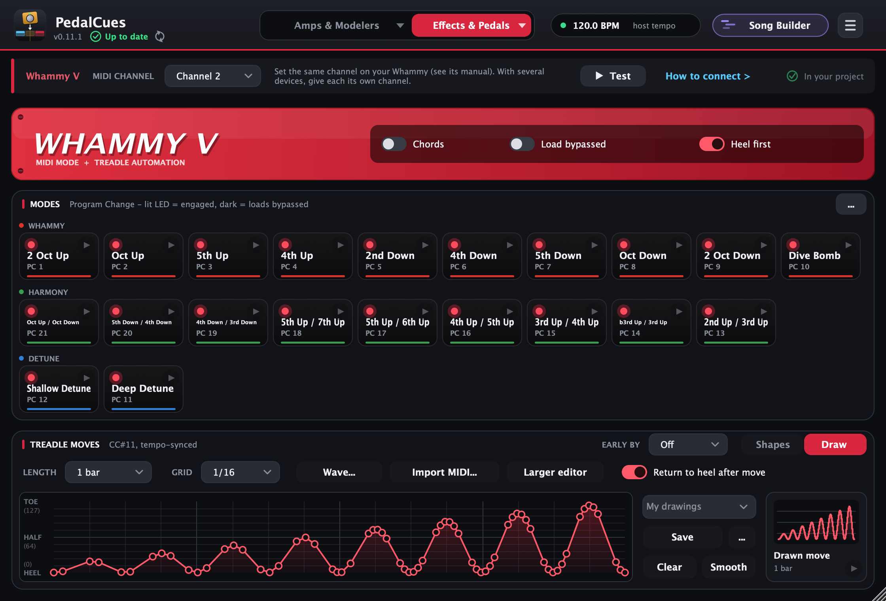 | 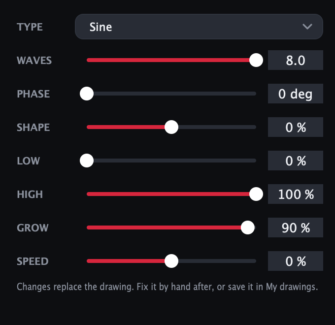 |

**Wave...** (in Draw mode, next to Length) writes a wave into the pad as you set it, like the CC LFO in Reaper's MIDI editor:

- **Type:** Sine, Triangle, Square, Saw up or Saw down.
- **Waves:** how many across the move (½ to 8). The move follows *Length*, so 4 waves over 1 bar is a steady quarter-note wobble.
- **Phase:** where the wave starts: 0° at its low point, 180° at its high point.
- **Shape:** tilts each wave: a triangle leans towards a saw, a sine rises fast and falls slowly (or the other way round), a square gets a shorter or longer high part.
- **Low / High:** the range the wave moves in (0 % = heel, 100 % = toe), for example a gentle wah between 30 % and 70 %.
- **Grow:** above 0 the waves build up from *Low* to full across the move; below 0 they die away (Reaper's *amp skew*).
- **Speed:** above 0 the waves speed up across the move; below 0 they slow down (Reaper's *frequency skew*).

Each change replaces the drawing. Fix it by hand afterwards, Smooth it, or **Save** it in My drawings. Wave... is in every Draw mode: the Whammy treadle, the Quad Cortex and Kemper expression, the Fractal, Line 6 and HeadRush pedals, and custom devices.

#### Import MIDI...: reuse a move you made in your DAW

Drew a treadle bend or an expression swell as CC automation in your DAW and want it again in other songs? Export (or drag) the clip as a `.mid` file, then click **Import MIDI...** in Draw mode (or drop the file on the card):

- PedalCues reads the card's own CC (CC#11 for the Whammy, the expression CC elsewhere); if the file has another CC, the one it uses most (never bank select), or else pitch bend.
- The move keeps its timing: it starts where the clip starts, and *Length* becomes the shortest length that holds it (up to 8 bars), with the last value held to the end. Longer clips keep their first 8 bars.
- It then asks for a name to save it in **My drawings** (the file's name is suggested), so you can drag it into any song, as often as you like.

It's in every Draw mode, like Wave....

#### My drawings: save and reuse your moves

Keep the moves you like and use them again in any song:

- **Save** keeps the drawing on the pad under a name, for example *Big Bend*. The tile and the clips you drag take that name (`Whammy Big Bend 1 bar`).
- **My drawings** (the list above Save) loads a saved drawing onto the pad, ready to drag or to edit. Pick **New drawing** to start from a clear pad.
- **Edit** a loaded drawing by drawing over it, or with Clear and Smooth. The tile shows *edited* until you click **Save** again, which updates that saved drawing.
- **…** has **Save as new drawing** (keep the original and save a copy), **Rename** and **Delete**.

My drawings are saved **on your computer**, not in one project, so every project, every PedalCues track and the standalone app see the same list, and updates keep them. The same list appears in the Quad Cortex page's [Expression](#expression-swells-fades-and-wah) Draw mode, so a drawing works as a treadle move and as an expression move. Clips you've already dragged onto the timeline never change when you edit or delete a drawing. To take them to another computer, use **Export setup** (it includes My drawings) and **Import setup** there, which adds them to that computer's list.

---

## 11. MIDI channels, How to connect and your setup


**The strip at the top of each page** (set once, required):
- **MIDI channel:** the channel the device on this tab listens on. Set the same on the device itself (the hint next to it says where) and give each device a different one. Every device keeps its own channel: the Quad Cortex, a Kemper, each Fractal / Line 6 / HeadRush / Darkglass page, each custom device, the Whammy V and the Whammy DT. Every cue is sent on it, and each clip keeps the channel it was dragged with, so set it before building songs. Until you click **Done**, the strip reminds you in amber.
- **Test:** sends a quick check to the device on its channel and says what it sent: the amp modeller opens and closes its tuner (CC#45 on the QC, CC#31 on the Kemper; preset 1 or a tap on units without a tuner over MIDI), a custom MIDI device sends your first tile, the DL4 MkII and HX One load their first preset, and the Whammy steps through **Oct Up, 5th Up and 2 Oct Up** half a second apart. In your DAW it goes out of this track's MIDI output; in the standalone app, to the port picked in How to connect.
- **How to connect >** opens the **Connect your rig** window (also **☰ > How to connect**, **Help > How to Connect** in the standalone app).

| Connect your rig (plugin) | Connect your rig (standalone app) |
|---|---|
|  |  |

**Connect your rig:**
- **Test your devices** (standalone app only): the MIDI port the app sends to (a port you plug in appears by itself) and **Test all**, which tests both devices at once.
- **Set up your DAW:** with two devices, pick how they're connected: **Each device on its own output** (the simplest) or **One cable through the amp modeller** (a daisy chain through its MIDI Thru; only offered when it has one). The daisy chain needs a MIDI cable into the amp modeller, not USB: an amber note says what your unit does with USB MIDI (the QC and Kemper never pass it on to their Thru; some units do only with a setting, named there; a few always do). With one device there's nothing to choose. The steps use generic tracks, an amp modeller track and a pedal track, with your devices as examples. Pick **Your DAW** (Reaper, Ableton Live, Cubase / Nuendo, Logic Pro or Other) to see where that DAW sets a track's MIDI output. **Wiring guide: cables and diagrams** opens the wiring guide: one device, a daisy chain or separate outputs, with the cables and signal flow for each and the setup that doesn't work.

### Your setup: save, share, start new projects with it

Your setup is your preset, scene, footswitch and Whammy names and colours, every device's MIDI channel and the other MIDI settings, and your playing preferences: the Whammy's **Chords**, **Load bypassed** and **Heel first**, **Return to heel** / **Back to heel after move**, and Expression's **Load 1A first**; your amp modeller or MIDI device, your custom MIDI devices, and the Kemper's **Load P1 first**, **Keep tails** and **Back to heel after move**. It's stored inside each DAW project automatically. (Length and Curve change from song to song, so they stay in each project.) From the **☰** menu (the **File** menu in the standalone app):
- **Save as default setup:** new PedalCues instances start with it.
- **Load default setup:** brings it back into this project.
- **Export setup / Import setup:** a file to back up, move to another computer, or share with your band. It also carries your **wiring choice** (Daisy chain or Separate outputs) and your [saved drawings](#my-drawings-save-and-reuse-your-moves); importing adds the drawings to your list and never removes any.

Settings that belong to one computer stay there and aren't exported: the standalone app's MIDI port and tempo (port names differ between computers), *Check for updates automatically*, whether you've seen the quick tour, and whether you've confirmed your MIDI channels.

### Updates

Under the title, PedalCues shows your version and whether it's **Up to date**. When a newer release is out, it says **Update to vX.Y.Z**: click it to see what's new and download it: the installer on macOS and Windows (quit your DAW, run it, and it replaces the old version), the zip with `install.sh` on Linux. It says **Couldn't check** when you're offline. The round arrows next to it check again.

PedalCues asks GitHub for the latest release when it opens; nothing else is sent. To turn that off, untick **Check for updates automatically** in the **☰** menu (in the standalone app: the **PedalCues** menu on macOS, **Help** on Windows). See what changed in each version on the [What's new](https://thankost.github.io/pedal-cues/changelog.html) page (**☰ > What's new** in the plugin, **Help > What's New** in the standalone app).

### The standalone app

- **Menus:** **File** saves, loads, exports and imports your setup; **Options > MIDI Output** picks the port; **Help** has the quick tour, the user guide, the wiring guide, What's New, Report a Problem and support. On macOS, **About** and **Check for Updates** are in the **PedalCues** menu.
- **Tempo:** there's no DAW, so click the BPM pill (**set tempo**) to type, drag or **Tap** your song's tempo. It only affects how long treadle moves last when you test them.

---

## 12. Troubleshooting

| Problem | Fix |
|---|---|
| Nothing happens on the pedal | Check the track's MIDI output (Reaper: *MIDI Hardware Output*) and that the pedal's MIDI port is enabled in your DAW's MIDI preferences. Try a tile's play button. |
| Sync from QC: "the loaded preset has unsaved changes" | Reading every preset loads each one, which would lose those edits. Save (or discard) them on the QC, then sync again. Or untick "every ticked preset" to import names and the loaded preset only. |
| Sync from QC: "No Quad Cortex found" or "Couldn't open" | Connect the QC's **USB** port (not just MIDI) and switch it on. Quit **Cortex Control**, which keeps the USB connection to itself. Wait until the QC has fully started, then try again. On **Linux**, install the USB permission rule from [Install](#1-install) once. |
| Standalone app: tiles do nothing | Pick the port your devices are on in **How to connect** (or **Options > MIDI Output**), then try **Test** at the top of the page. On Windows, close your DAW first; only one program can use a MIDI port at a time. |
| Scene or stomp changes the wrong preset | **Load 1A first** is off, so tiles act on whatever preset the QC has loaded. Switch it on in the Scenes header so they load their own preset first. |
| A stomp tile changes scenes | The QC is in Scene mode, where footswitch A-H select scenes. Put the QC in Stomp mode (or drop the **Stomp Mode** tile before your stomp cues). Before v0.4.2 the Scene Mode and Stomp Mode tiles were swapped; drag those clips in again. |
| The QC stays in another setlist | Turn on **Switch to the preset's setlist** (under the preset list, or the **Setlists not sent: turn on** button above *Sync from QC*), check the preset's setlist number in *Edit preset*, then drag its clips into your DAW again: clips keep what they were dragged with. |
| Wrong preset loads | Check setlist, bank and slot in *Edit preset*. If presets are in other setlists, turn on **Switch to the preset's setlist** under the preset list. Setlist numbers are as the QC shows them (Factory Presets = 0). Before v0.4.28 PedalCues sent one less, so if you added 1 to work around it, set them back. |
| The scene changes a little after the beat | That's the 1/16 gap of **Load 1A first**, which gives the QC time to load the preset. Drop the tile 1/16 early, or switch Load 1A first off inside the song. See [Timing](#timing-scenes-right-after-a-preset). |
| Whammy doesn't react | If the QC is on USB and the Whammy hangs off the QC's Thru, that can't work: the QC doesn't forward USB MIDI (a known QC limitation). Use one of the [three working setups](#2-connect-your-rig). Otherwise check the cable direction (MIDI Out to MIDI In) and the channels, set the QC to a fixed channel (not *Omni*), and for the daisy chain turn on QC MIDI Thru. |
| My amp changes preset or slot when a Whammy cue plays | The amp modeller is on *Omni*, so it also hears the Whammy's Program Changes. Set it to a fixed channel, different from the Whammy's, and the same number at the top of its page. |
| I changed a channel, but old clips still use the old one | Clips keep the channel they were dragged with. Drag those tiles in again (or change the clips' channel in your DAW). |
| Kemper doesn't react | Set the Kemper to a fixed MIDI channel (not *Omni*) and the same number at the top of the Kemper page. Put Kemper clips on the **Kemper Cues** track. Check that **Amp modeller** is set to your Kemper model. |
| Kemper loads the wrong slot | Check the performance number in *Edit performance*. **Load P1 first** off loads that slot of the performance the Kemper *already has*; switch it on to load the performance too. |
| Whammy doesn't react (Kemper on USB) | Like the QC, the Kemper doesn't pass USB MIDI on to its MIDI Thru. Give the Whammy its own MIDI output, or send to the Kemper's 5-pin MIDI In. See [Connect your rig](#2-connect-your-rig). |
| An Axe-Fx III, FM9, FM3 or VP4 scene or tuner tile does nothing | These units have no default MIDI CCs. Assign the numbers from the device's Notes in *SETUP > MIDI/Remote*, or change the tiles to yours. On an FM3, use a 5-pin MIDI cable: it can't be controlled over USB. |
| A Helix / Fractal page tile does nothing | Check the unit's MIDI channel (*About this unit* says where) against the channel at the top of its page, and that the cue track sends to the unit. On a Fractal page, the CCs are the factory defaults: if you changed them on the unit, use a custom MIDI device. |
| A Helix preset loads from the wrong setlist | Turn on **Switch to the preset's setlist** under the preset list, check the preset's setlist, then drag its clips in again. |
| A custom device tile does nothing | Check the device's MIDI channel (the same at the top of its page and on the device) and its MIDI chart: CC numbers and values differ for every device. Try **Test on the device** in the tile editor. |
| A custom device loads the preset next to the one I wanted | Its manual counts presets from the other number: switch **Programs count from 0 / 1** on the device card. |
| Expression tiles do nothing | Assign the parameter to **Expression 1** (or 2) on the QC, in that preset, and pick the same **Exp 1 / Exp 2** in PedalCues. The clips must be on the **QC Cues** track, on the QC's channel. |
| Expression moves the wrong thing | It acts on the preset the QC has loaded. Put the move after the right preset or scene clip, or switch on **Load 1A first** in Expression. |
| Whammy clips do nothing | Whammy clips must be on the **Whammy Cues** track, whose output leads to the Whammy. |
| How do I update? | When the header says **Update available**, click it and choose **Download**. Close your DAW, then open the installer on macOS, or replace the plugin files the same way you [installed](#1-install) them on Windows and Linux. Your setup and projects are kept. |
| Drop Tune tiles are missing | Pick **Whammy DT** (not Whammy V) with the **▾** on the Effects & Pedals tab, then click **Drop Tune** in the Modes header. |
| A Whammy DT mode tile changed my tuning | The page is set to Whammy V with **Chords** on: on the DT those program numbers are Drop Tune. Switch the page to **Whammy DT**. |
| Whammy mode is one off | On the Whammy page, click **...** in the Modes header and choose **Zero-based (0 = first)**. |
| Clip lands between bars | Turn on snap to grid in your DAW before dropping. |
| macOS says PedalCues "is damaged and can't be opened" | It isn't damaged; macOS blocks apps downloaded from the internet that Apple hasn't notarised. Use the installer (`PedalCues-macOS.pkg`), or run `xattr -cr /Applications/PedalCues.app` in Terminal. See [Install](#1-install). |
| macOS won't open the installer ("can't be verified") | Click **Done**, then *System Settings > Privacy & Security > Open Anyway*, within a few minutes. See [Install](#1-install). |
| My DAW lists PedalCues twice (macOS) | You have an old zip install in your user folder too. Delete `~/Library/Audio/Plug-Ins/VST3/PedalCues.vst3` and `~/Library/Audio/Plug-Ins/Components/PedalCues.component`, then re-scan. |

Still stuck, found a bug or have an idea? Use **☰ > Report a problem** in the plugin (**Help > Report a Problem** in the standalone app). It opens a short form on GitHub with your PedalCues version and computer already filled in (you need a free GitHub account). You can also start from the [Help page](https://thankost.github.io/pedal-cues/help.html), or [suggest an idea](https://github.com/thankost/pedal-cues/issues/new?template=idea.yml).

Enjoying PedalCues? It's free; if you'd like to support it, you can donate via [Buy Me a Coffee](https://buymeacoffee.com/athkost), [PayPal](https://paypal.me/athkost) or [Revolut](https://revolut.me/athkost), or sponsor it on [GitHub Sponsors](https://github.com/sponsors/thankost), or from **☰ > Support PedalCues** in the plugin. Completely optional.

---

PedalCues is free software by **Thanasis Kostopoulos**, released under the [MIT License](../LICENSE). Source: [github.com/thankost/pedal-cues](https://github.com/thankost/pedal-cues). In the plugin, open **☰ > About PedalCues**. Not affiliated with any device maker. All product and company names are trademarks of their respective owners.
